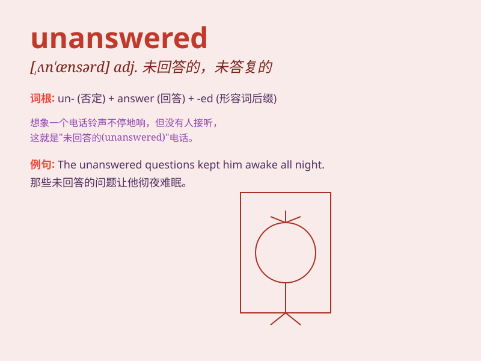

## unanswered

**英音:** _[ʌn\'ɑːnsəd]_ **美音:** _[ʌn\'ɑnsɚd]_

**译义:** *adj.未答复的,无反应的*

### 短语

+ **unanswered question:** _未回答的问题_

+ **unanswered prayer:** _未得到回应的祈祷_

+ **unanswered call:** _未接听的电话_

+ **unanswered letter:** _未回复的信件_

+ **unanswered challenge:** _未应对的挑战_

### 例句

#### 例句1

> **The question remained unanswered for a long time.**

**中文翻译:** 这个问题很长时间都没有得到回答。

**单词释义:** 未得到回答的

#### 例句2

> **His letter went unanswered.**

**中文翻译:** 他的信没有得到回复。

**单词释义:** 未被回复的

#### 例句3

> **Many of the complaints are still unanswered.**

**中文翻译:** 许多投诉仍然没有得到答复。

**单词释义:** 未得到答复的

### 背诵小故事

> A detective was faced with many unanswered questions in a mysterious
case. No one could provide the needed answers. It seemed like the truth
was hidden and all inquiries remained unanswered.

**一位侦探在一个神秘案件中面临许多未回答的问题。没人能提供所需的答案。似乎真相被隐藏了，所有的询问都未得到回答。**

### 图义

