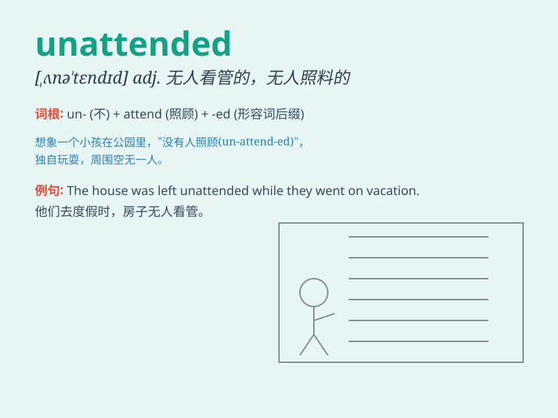

## unattended

**英音:** _[ʌnə\'tendɪd]_ **美音:** _[,ʌnə\'tɛndɪd]_

**译义:**
*adj.没人照顾的,未被注意的,无人出席的,(伤口等)未敷裹的,没有同伴的*

### 短语

+ **unattended bag:** _无人看管的包_

+ **unattended children:** _无人照看的儿童_

+ **unattended machine:** _无人操作的机器_

+ **unattended property:** _无人看管的财产_

+ **unattended fire:** _无人照看的火_

### 例句

#### 例句1

> **The unattended bag was removed by the security personnel.**

**中文翻译:** 那个无人看管的包被保安人员拿走了。

**单词释义:** 无人看管的

#### 例句2

> **The garden was left unattended for weeks.**

**中文翻译:** 花园已经好几周无人打理了。

**单词释义:** 无人打理的

#### 例句3

> **The unattended child was crying in the corner.**

**中文翻译:** 那个无人照顾的孩子在角落里哭。

**单词释义:** 无人照顾的

### 背诵小故事

> One night, I walked into an unattended store. There was no one to
serve me. It felt strange as everything was left without attention.
Later I realized \'unattended\' means not being watched or taken care
of.

**一天晚上，我走进一家无人看管的商店。没有人服务我。感觉很奇怪，因为一切都无人关注。后来我意识到\'unattended\'意思是无人看管或无人照顾。**

### 图义

