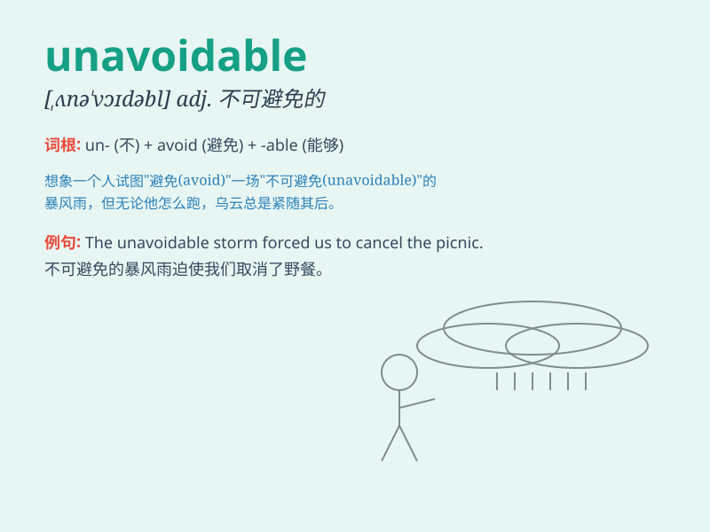

## unavoidable

**英音:** _[ʌnə\'vɒɪdəb(ə)l]_ **美音:**
_[,ʌnə\'vɔɪdəbl]_

**译义:** *adj.不能避免的,不可避免的,不能取消的*

### 短语

+ **unavoidable consequence:** _不可避免的后果_

+ **unavoidable delay:** _不可避免的延误_

+ **unavoidable expense:** _不可避免的开支_

+ **unavoidable risk:** _不可避免的风险_

+ **unavoidable choice:** _不可避免的选择_

### 例句

#### 例句1

> **The traffic jam was unavoidable during the rush hour.**

**中文翻译:** 在高峰时段，交通堵塞是不可避免的。

**单词释义:** 不可避免的

#### 例句2

> **Death is an unavoidable part of life.**

**中文翻译:** 死亡是生命中不可避免的一部分。

**单词释义:** 不可避免的

#### 例句3

> **Some mistakes in the experiment were unavoidable.**

**中文翻译:** 实验中的一些错误是不可避免的。

**单词释义:** 不可避免的

### 背诵小故事

> A brave adventurer was on a journey. He faced many challenges. One
day, he encountered a huge storm. There was no way to escape. This
situation was unavoidable. He had to face it bravely.

**一位勇敢的冒险家正在旅途中。他面临许多挑战。有一天，他遭遇了一场巨大的风暴。无处可逃。这种情况是不可避免的。他不得不勇敢面对。**

### 图义

