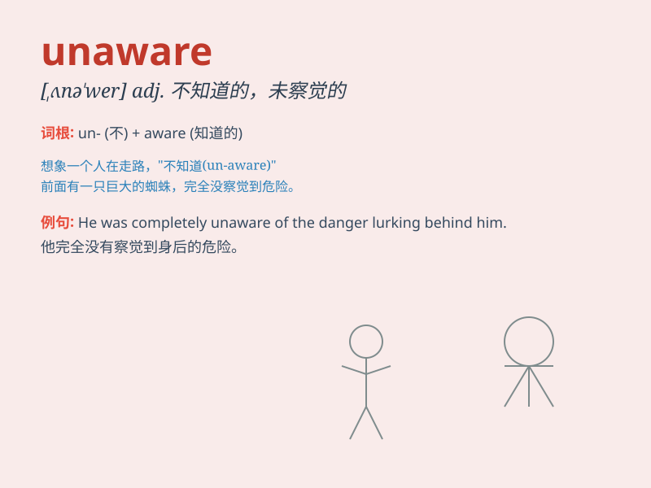

## unaware

**英音:** _[ʌnə\'weə]_ **美音:** _[,ʌnə\'wɛr]_

**译义:** *adj.不知道的,没觉察到的*

### 短语

+ **be unaware of:** _不知道；未察觉到_

+ **remain unaware:** _仍然未意识到_

+ **become unaware:** _变得未察觉_

+ **total unaware:** _完全未察觉_

+ **suddenly unaware:** _突然未意识到_

### 例句

#### 例句1

> **He was unaware of the danger lurking around the corner.**

**中文翻译:** 他没有意识到潜伏在拐角处的危险。

**单词释义:** 没有意识到

#### 例句2

> **She remained unaware of the changes in the company\'s policy.**

**中文翻译:** 她仍然不知道公司政策的变化。

**单词释义:** 不知道

#### 例句3

> **They were completely unaware that they were being watched.**

**中文翻译:** 他们完全没有察觉到他们正在被监视。

**单词释义:** 没有察觉到

### 背诵小故事

> One day, Tom was walking in the park, completely unaware that his
wallet had fallen out of his pocket. When he got home, he was shocked to
find it missing. Poor Tom!

**一天，汤姆在公园散步，完全没有意识到他的钱包从口袋里掉了出来。当他到家时，他震惊地发现钱包不见了。可怜的汤姆！**

### 图义

