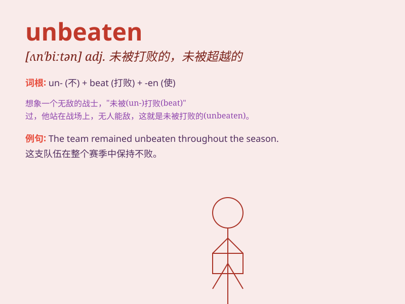

## unbeaten

**英音:** _[ʌn\'biːt(ə)n]_ **美音:** _[ʌn\'bitn]_

**译义:** *adj.未被打过的*

### 短语

+ **unbeaten record:** _不败纪录_

+ **unbeaten path:** _未走过的路；人迹罕至的道路_

+ **unbeaten team:** _不败之队_

+ **remain unbeaten:** _保持不败_

+ **unbeaten champion:** _不败的冠军_

### 例句

#### 例句1

> **The unbeaten team continued their winning streak.**

**中文翻译:** 这支不败的队伍继续着他们的连胜。

**单词释义:** 未被打败的；不败的

#### 例句2

> **He holds the record for the longest unbeaten run in tennis.**

**中文翻译:** 他保持着网球比赛中最长不败纪录。

**单词释义:** 未被击败的

#### 例句3

> **The unbeaten champion was confident of another victory.**

**中文翻译:** 这位不败的冠军对再次获胜充满信心。

**单词释义:** 未被战胜的

### 背诵小故事

> In a fierce sports competition, everyone expected the defending
champion to lose. But to everyone\'s surprise, they remained unbeaten.
They were so strong and skilled that no opponent could defeat them.

**在一场激烈的体育比赛中，所有人都以为卫冕冠军会输。但令所有人惊讶的是，他们保持不败。他们是如此强大和有技巧，没有对手能够打败他们。**

### 图义

