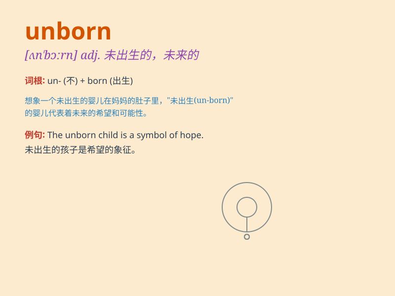

## unborn

**英音:** _[ʌn\'bɔːn]_ **美音:** _[\'ʌn\'bɔrn]_

**译义:** *adj.未来的*

### 短语

+ **unborn child:** _未出生的孩子_

+ **unborn generation:** _未出生的一代_

+ **unborn hope:** _未实现的希望_

+ **unborn potential:** _未开发的潜力_

+ **unborn dream:** _未实现的梦想_

### 例句

#### 例句1

> **The fate of the unborn child hangs in the balance.**

**中文翻译:** 未出生孩子的命运悬而未决。

**单词释义:** 未出生的

#### 例句2

> **She has a deep concern for the rights of the unborn.**

**中文翻译:** 她深切关注未出生者的权利。

**单词释义:** 未出生的

#### 例句3

> **The unborn baby kicked vigorously during the ultrasound.**

**中文翻译:** 在超声波检查中，未出生的宝宝用力踢动。

**单词释义:** 未出生的

### 背诵小故事

> Imagine a world where babies are waiting to be born. But some are
still unborn, hidden in their mothers\' wombs, waiting for the right
time to come into this world. They are the unborn, full of potential and
mystery.

**想象一个世界，宝宝们在等待出生。但有些仍未出生，藏在妈妈的子宫里，等待合适的时机来到这个世界。他们就是未出生的，充满了潜力和神秘。**

### 图义

