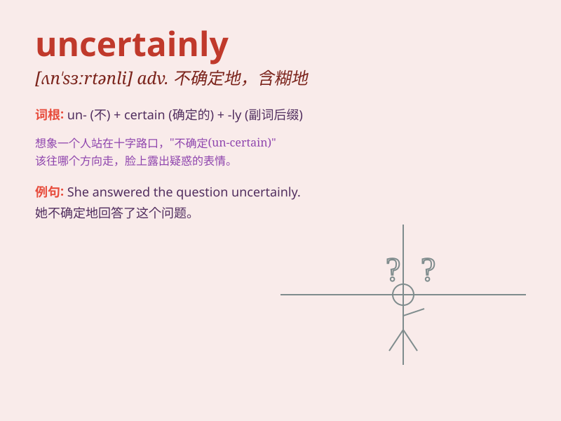

## uncertainly

**英音:** _[ʌnˈsɜːtnli]_ **美音:** _[ʌnˈsɜːrtnli]_

**译义:** *adv.不确定地；含糊地；不明确地*

### 短语

+ **in uncertainty:** _处于不确定之中_

+ **uncertain future:** _不确定的未来_

+ **remain uncertain:** _仍然不确定_

+ **uncertain outcome:** _不确定的结果_

+ **uncertain situation:** _不确定的情况_

### 例句

#### 例句1

> **He answered the question uncertainly.**

**中文翻译:** 他不确定地回答了这个问题。

**单词释义:** 不确定地

#### 例句2

> **She walked forward uncertainly, not sure what to expect.**

**中文翻译:** 她不确定地向前走，不知道会发生什么。

**单词释义:** 不确定地

#### 例句3

> **The future of the project remains uncertainly.**

**中文翻译:** 这个项目的未来仍不确定。

**单词释义:** 不确定

### 背诵小故事

> One day, Tom was asked about the result of an experiment. He answered
uncertainly, \'I\'m not sure. Maybe it will succeed, or maybe it will
fail.\' This shows his lack of confidence and definite knowledge.

**有一天，汤姆被问到一个实验的结果。他不确定地回答道："我不确定。也许会成功，也许会失败。"这显示出他缺乏信心和明确的认知。**

### 图义

