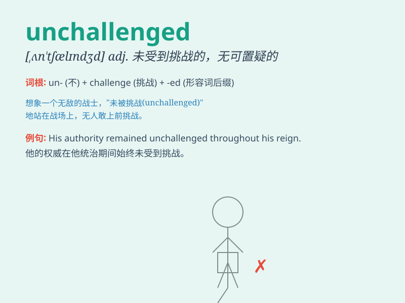

## unchallenged

**英音:** _[ʌn\'tʃælɪn(d)ʒd]_ **美音:**
_[ʌn\'tʃælɪndʒd]_

**译义:** *adj.未受到挑战的,未引起争论的,不成问题的*

### 短语

+ **remain unchallenged:** _保持未受挑战_

+ **go unchallenged:** _未受到质疑_

+ **stand unchallenged:** _屹立不倒未受挑战_

+ **pass unchallenged:** _顺利通过未受挑战_

+ **be unchallenged:** _未被挑战_

### 例句

#### 例句1

> **His authority remained unchallenged for many years.**

**中文翻译:** 他的权威多年来未受到挑战。

**单词释义:** 未受到挑战的

#### 例句2

> **The theory went unchallenged until recently.**

**中文翻译:** 该理论直到最近都未受到质疑。

**单词释义:** 未受到质疑的

#### 例句3

> **She held the position unchallenged for a decade.**

**中文翻译:** 她毫无争议地担任这个职位达十年之久。

**单词释义:** 毫无争议的

### 背诵小故事

> A thief was stealing in the market but remained unchallenged. People
were too scared to stop him. Later, the police came and the thief\'s
actions were no longer unchallenged.

**一个小偷在市场里偷东西却未受到质疑。人们太害怕了不敢阻止他。后来警察来了，小偷的行为不再未受质疑。**

### 图义

