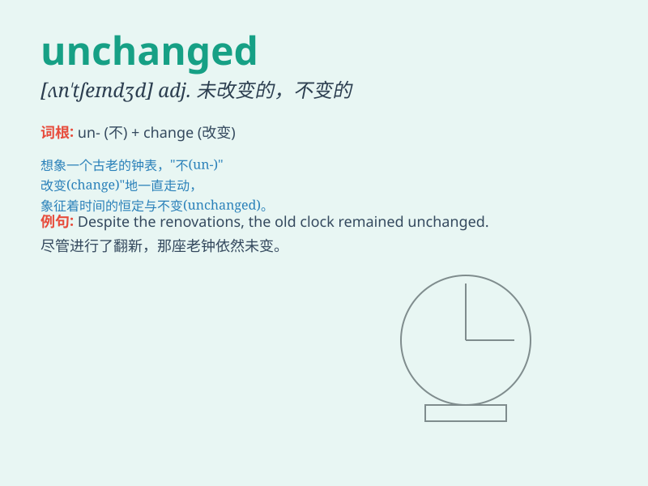

## unchanged

**英音:** _[ʌnˈtʃeɪndʒd]_ **美音:** _[ʌnˈtʃeɪndʒd]_

**译义:** *adj.无变化的,未改变的*

### 短语

+ **remain unchanged:** _保持不变_

+ **stay unchanged:** _维持不变_

+ **unchanged situation:** _未改变的情况_

+ **unchanged policy:** _未改变的政策_

+ **unchanged feature:** _未改变的特征_

### 例句

#### 例句1

> **The price remained unchanged for several months.**

**中文翻译:** 价格几个月来保持不变。

**单词释义:** 不变的

#### 例句2

> **Her attitude towards him was unchanged despite his apology.**

**中文翻译:** 尽管他道歉了，她对他的态度仍未改变。

**单词释义:** 未改变的

#### 例句3

> **The rules of the game have remained unchanged for years.**

**中文翻译:** 这个游戏的规则多年来一直未变。

**单词释义:** 未改变的

### 背诵小故事

> Once upon a time, a precious treasure was hidden in a secret room.
Years passed, and when the room was opened again, the treasure remained
unchanged. Just like this word \'unchanged\', meaning not having
changed.

**从前，有一件珍贵的宝藏被藏在一个密室里。多年过去了，当密室再次被打开时，宝藏依旧未变。就像单词\'unchanged\'，意思是未改变的。**

### 图义

