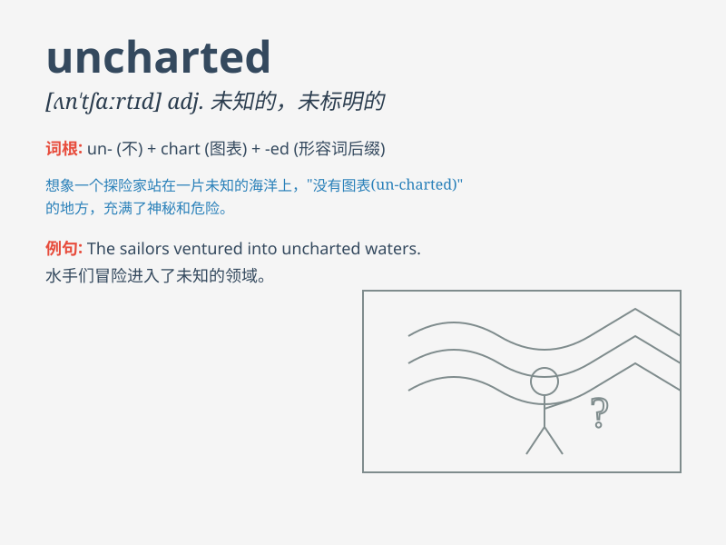

## uncharted

**英音:** _[ʌn\'tʃɑːtɪd]_ **美音:** _[,ʌn\'tʃɑrtɪd]_

**译义:** *adj.海图上未标明的,未知的,不详的*

### 短语

+ **uncharted territory:** _未知领域；未被探索的地区_

+ **uncharted waters:** _未标明的水域；未知的情况_

+ **uncharted course:** _未规划的路线；未知的进程_

+ **uncharted island:** _未被标注的岛屿；无人知晓的岛屿_

+ **uncharted region:** _未被绘制地图的地区；未被了解的区域_

### 例句

#### 例句1

> **The explorers ventured into uncharted territory.**

**中文翻译:** 探险者们冒险进入了未知的领域。

**单词释义:** 未知的；未被绘制地图的

#### 例句2

> **Her career path has led her into uncharted waters.**

**中文翻译:** 她的职业道路把她带入了未知的境地。

**单词释义:** 未知的；未曾经历过的

#### 例句3

> **The company is exploring uncharted markets to expand its
business.**

**中文翻译:** 这家公司正在探索未知的市场以拓展业务。

**单词释义:** 未知的；未开发的

### 背诵小故事

> A brave explorer set out on a journey into uncharted territory. There
were no maps, only mystery. He faced unknown dangers but was determined
to discover. \'Uncharted\' means not mapped or unknown.

**一位勇敢的探险家踏上了一片未知的领域之旅。这里没有地图，只有神秘。他面临着未知的危险，但决心去探索。'uncharted'意思是未绘制地图的或未知的。**

### 图义

