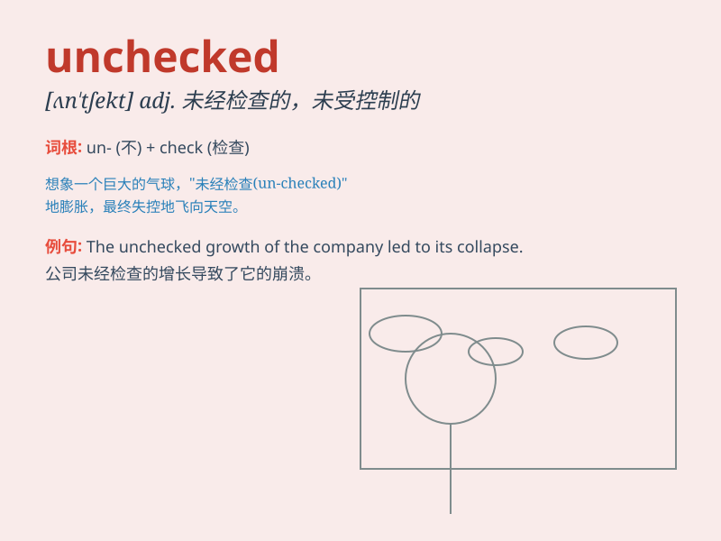

## unchecked

**英音:** _[ʌn\'tʃekt]_ **美音:** _[\'ʌn\'tʃɛkt]_

**译义:** *adj.未受制止的,未经检查的,未加抑制的,未选中的*

### 短语

+ **unchecked growth:** _不受控制的增长_

+ **unchecked power:** _未受约束的权力_

+ **unchecked enthusiasm:** _毫无节制的热情_

+ **unchecked aggression:** _肆意的侵略_

+ **unchecked violence:** _未加制止的暴力_

### 例句

#### 例句1

> **The unchecked growth of the city has led to many problems.**

**中文翻译:** 城市不受控制的增长导致了许多问题。

**单词释义:** 不受控制的；未受抑制的

#### 例句2

> **The unchecked anger of the boss frightened the employees.**

**中文翻译:** 老板未加抑制的愤怒吓到了员工。

**单词释义:** 未受约束的；未加制止的

#### 例句3

> **The unchecked spread of the disease is a serious concern.**

**中文翻译:** 这种疾病不受控制的传播是一个严重的问题。

**单词释义:** 未受检查的；未加审核的

### 背诵小故事

> A king\'s unchecked power led to chaos in the kingdom. People were
unhappy as there was no one to stop his wild decisions. \'Unchecked\'
here means not controlled or restricted.

**一位国王不受约束的权力导致了王国的混乱。人们很不高兴，因为没有人能阻止他疯狂的决定。"unchecked"在这里指的是不受控制或限制的。**

### 图义

