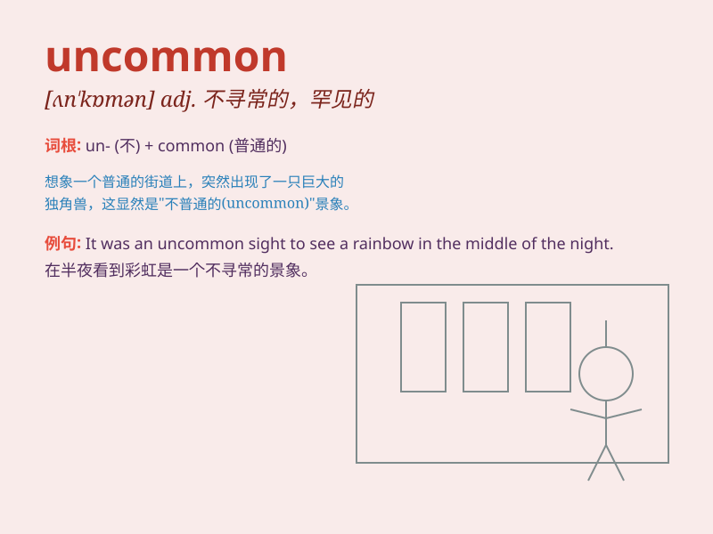

## uncommon

**英音:** _[ʌn\'kɒmən]_ **美音:** _[ʌn\'kɑmən]_

**译义:** *adj.不凡的,罕有的,难得的*

### 短语

+ **uncommon sense:** _非凡的见识_

+ **uncommon beauty:** _罕见的美丽_

+ **uncommon talent:** _非凡的才能_

+ **uncommon occurrence:** _罕见的事件_

+ **uncommon experience:** _不寻常的经历_

### 例句

#### 例句1

> **It is uncommon to see snow in this region in October.**

**中文翻译:** 在这个地区十月份下雪是不常见的。

**单词释义:** 不常见的；罕见的

#### 例句2

> **His uncommon intelligence helped him solve the difficult problem
easily.**

**中文翻译:** 他非凡的智力帮助他轻松地解决了这个难题。

**单词释义:** 非凡的；出众的

#### 例句3

> **Such an uncommon occurrence raised many questions.**

**中文翻译:** 这样罕见的事件引发了许多问题。

**单词释义:** 罕见的；不平常的

### 背诵小故事

> Once upon a time, in a common forest, there was a very special
flower. It was so beautiful and unique that it was uncommon. People came
from far away just to see it. Remember, \'uncommon\' means not common,
rare.

**从前，在一个普通的森林里，有一朵非常特别的花。它是如此美丽和独特，是不常见的。人们从很远的地方赶来只为看它。记住，'uncommon'意思是不常见的，罕见的。**

### 图义

