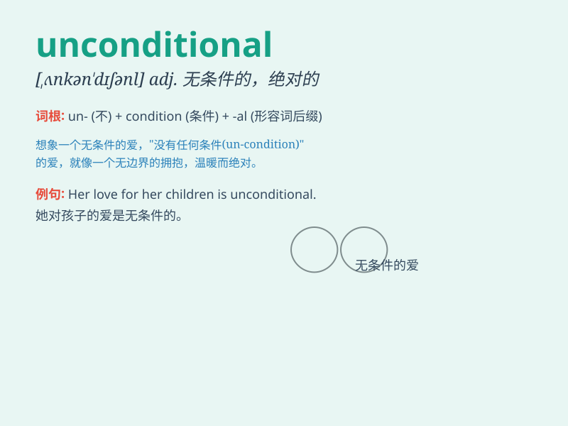

## unconditional

**英音:** _[ʌnkən\'dɪʃ(ə)n(ə)l]_ **美音:**
_[,ʌnkən\'dɪʃənl]_

**译义:** *adj.无条件的,绝对的,无限制的*

### 短语

+ **unconditional love:** _无条件的爱_

+ **unconditional surrender:** _无条件投降_

+ **unconditional acceptance:** _无条件接受_

+ **unconditional guarantee:** _无条件保证_

+ **unconditional support:** _无条件支持_

### 例句

#### 例句1

> **The mother\'s love for her child is unconditional.**

**中文翻译:** 母亲对孩子的爱是无条件的。

**单词释义:** 无条件的

#### 例句2

> **He offered unconditional support to his friend in need.**

**中文翻译:** 他向有需要的朋友提供了无条件的支持。

**单词释义:** 无条件的

#### 例句3

> **The contract was signed with unconditional acceptance from both
parties.**

**中文翻译:** 合同在双方无条件接受的情况下签署了。

**单词释义:** 无条件的

### 背诵小故事

> Once upon a time, a king\'s love for his people was unconditional. He
didn\'t ask for anything in return. Just like this, \'unconditional\'
means without any conditions or limits.

**从前，有个国王对他子民的爱是无条件的。他不求任何回报。就像这样，'unconditional'意思是没有任何条件或限制的。**

### 图义

