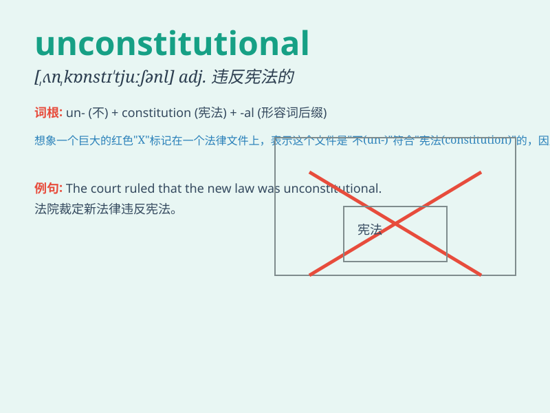

## unconstitutional

**英音:** _[,ʌnkɒnstɪ\'tjuːʃ(ə)n(ə)l]_ **美音:**
_[,ʌnkɑnstə\'tuʃənl]_

**译义:** *adj.违反宪法的*

### 短语

+ **unconstitutional act:** _违宪行为_

+ **unconstitutional law:** _违宪的法律_

+ **unconstitutional decision:** _违宪的决定_

+ **unconstitutional amendment:** _违宪的修正案_

+ **unconstitutional regime:** _违宪的政权_

### 例句

#### 例句1

> **The new law was declared unconstitutional by the Supreme
Court.**

**中文翻译:** 新的法律被最高法院宣布为违宪。

**单词释义:** 违宪的

#### 例句2

> **His actions were considered unconstitutional by many legal
experts.**

**中文翻译:** 他的行为被许多法律专家认为是违宪的。

**单词释义:** 违宪的

#### 例句3

> **The proposed policy is blatantly unconstitutional.**

**中文翻译:** 拟议的政策明显是违宪的。

**单词释义:** 违宪的

### 背诵小故事

> A king wanted to pass a law that allowed only his family to own land.
But the wise advisors said it was unconstitutional. They explained that
such a law went against the fair rules and rights of all people.

**一位国王想要通过一项只允许他的家族拥有土地的法律。但睿智的顾问们说这是违宪的。他们解释说这样的法律违背了所有人的公平规则和权利。**

### 图义

