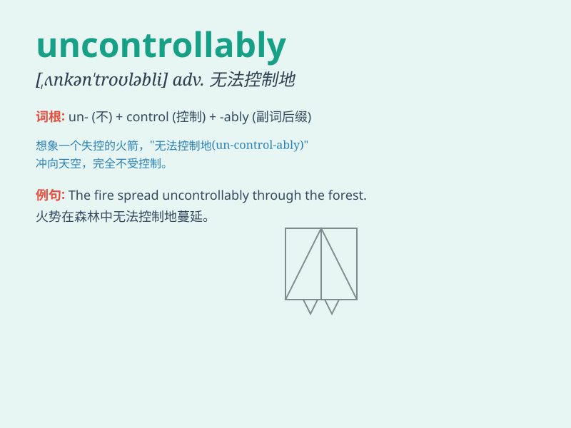

## uncontrollably

**英音:** _[ˌʌnkənˈtrəʊləbli]_ **美音:**
_[ˌʌnkənˈtroʊləbli]_

**译义:** *adv. 无法控制地；控制不住地*

### 短语

+ **laugh uncontrollably:** _无法控制地大笑_

+ **cry uncontrollably:** _无法控制地哭泣_

+ **shiver uncontrollably:** _无法控制地颤抖_

+ **tremble uncontrollably:** _无法控制地发抖_

+ **sweat uncontrollably:** _无法控制地出汗_

### 例句

#### 例句1

> **She laughed uncontrollably when she heard the joke.**

**中文翻译:** 当她听到这个笑话时，她情不自禁地大笑起来。

**单词释义:** 无法控制地；失控地

#### 例句2

> **The fire spread uncontrollably, threatening the entire
neighborhood.**

**中文翻译:** 火势失控地蔓延，威胁着整个街区。

**单词释义:** 无法控制地；不受约束地

#### 例句3

> **His emotions fluctuated uncontrollably after the bad news.**

**中文翻译:** 坏消息传来后，他的情绪不受控制地波动。

**单词释义:** 无法控制地；难以抑制地

### 背诵小故事

> A little monkey was in a candy store. When it saw the countless
candies, it laughed uncontrollably. It wanted to take all the candies
but couldn\'t control its excitement. Finally, it was led away by its
mother.

**一只小猴子在糖果店。当它看到数不清的糖果时，它不受控制地大笑起来。它想拿走所有的糖果，控制不住自己的兴奋。最后，它被妈妈带走了。**

### 图义

