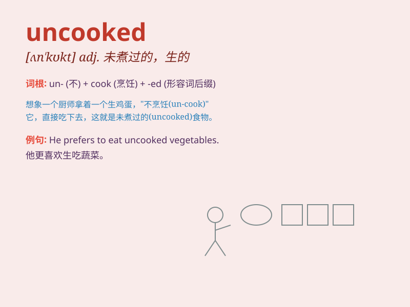

## uncooked

**英音:** _[ʌn\'kʊkt]_ **美音:** _[,ʌn\'kʊkt]_

**译义:** *adj.未煮过的*

### 短语

+ **uncooked meat:** _生肉_

+ **uncooked vegetables:** _未煮过的蔬菜_

+ **uncooked rice:** _生米_

+ **remain uncooked:** _保持未煮的状态_

+ **uncooked food:** _未烹饪的食物_

### 例句

#### 例句1

> **The uncooked meat is still on the counter.**

**中文翻译:** 未煮过的肉还在柜台上。

**单词释义:** 未煮过的

#### 例句2

> **She refused to eat the uncooked vegetables.**

**中文翻译:** 她拒绝吃未煮熟的蔬菜。

**单词释义:** 未煮熟的

#### 例句3

> **The chef found some uncooked rice in the pot.**

**中文翻译:** 厨师在锅里发现了一些未煮的米饭。

**单词释义:** 未煮的

### 背诵小故事

> One day, Tom was very hungry. He opened the fridge and found some
meat, but it was uncooked. So he had to cook it himself. Poor Tom had to
wait a long time before he could enjoy his meal.

**有一天，汤姆非常饿。他打开冰箱发现了一些肉，但它是生的。所以他不得不自己烹饪。可怜的汤姆不得不等很长时间才能享用他的饭。**

### 图义

