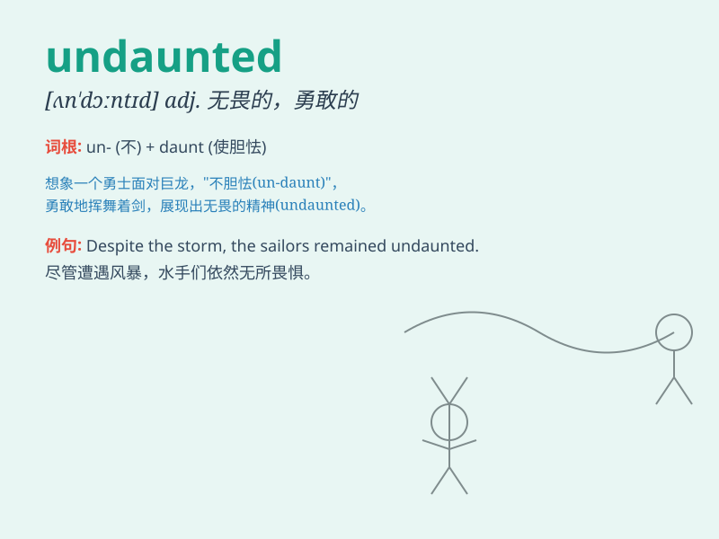

## undaunted

**英音:** _[ʌn\'dɔːntɪd]_ **美音:** _[,ʌn\'dɔntɪd]_

**译义:** *adj.大无畏的,勇敢的*

### 短语

+ **undaunted courage:** _无畏的勇气_

+ **remain undaunted:** _保持无畏_

+ **undaunted spirit:** _不屈的精神_

+ **face difficulties undaunted:** _无畏地面对困难_

+ **undaunted determination:** _坚定无畏的决心_

### 例句

#### 例句1

> **Despite the difficulties, she remained undaunted and continued to
pursue her goals.**

**中文翻译:** 尽管困难重重，她毫不畏惧，继续追求自己的目标。

**单词释义:** 毫不畏惧的

#### 例句2

> **The climbers were undaunted by the bad weather and set off as
planned.**

**中文翻译:** 登山者们没有被恶劣的天气吓倒，按计划出发了。

**单词释义:** 未被吓倒的

#### 例句3

> **He faced the criticism undaunted and defended his position
firmly.**

**中文翻译:** 他毫不畏惧地面对批评，坚定地捍卫自己的立场。

**单词释义:** 无畏的

### 背诵小故事

> A brave knight was on a dangerous quest. Facing many fierce monsters
and difficult obstacles, he remained undaunted. He kept moving forward
with courage and determination, never giving up.

**一位勇敢的骑士正在进行危险的探索。面对许多凶猛的怪物和艰难的障碍，他毫不畏惧。他带着勇气和决心继续前进，从不放弃。**

### 图义

