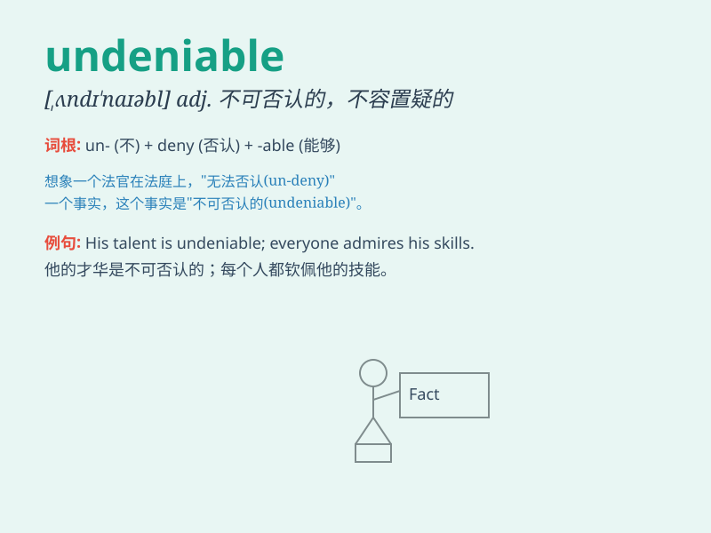

## undeniable

**英音:** _[ʌndɪ\'naɪəb(ə)l]_ **美音:**
_[\'ʌndɪ\'naɪəbl]_

**译义:** *adj.不可否认的*

### 短语

+ **undeniable fact:** _不可否认的事实_

+ **undeniable evidence:** _无可辩驳的证据_

+ **undeniable truth:** _不容置疑的真理_

+ **undeniable charm:** _不可抗拒的魅力_

+ **undeniable advantage:** _无可争辩的优势_

### 例句

#### 例句1

> **The beauty of the sunset is undeniable.**

**中文翻译:** 日落的美丽是不可否认的。

**单词释义:** 不可否认的

#### 例句2

> **His talent for music is undeniable.**

**中文翻译:** 他在音乐方面的天赋是不可否认的。

**单词释义:** 不可否认的

#### 例句3

> **The undeniable fact is that we need to take action
immediately.**

**中文翻译:** 不可否认的事实是我们需要立即采取行动。

**单词释义:** 不可否认的

### 背诵小故事

> A detective was working on a case. Every clue pointed to the
suspect\'s guilt, and the evidence was undeniable. No one could deny
that the suspect was involved. The word \'undeniable\' means impossible
to deny.

**一位侦探正在处理一个案子。每个线索都表明嫌疑人有罪，证据确凿无疑。没人能否认嫌疑人参与其中。\'undeniable\'这个单词意思是不可否认的。**

### 图义

