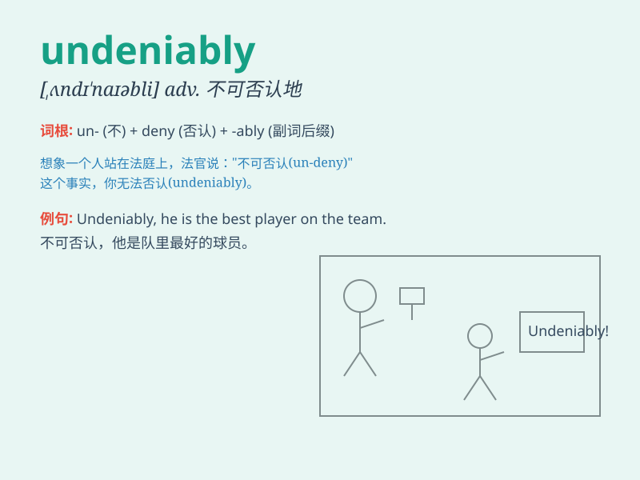

## undeniably

**英音:** _[ˌʌndɪˈnaɪəbli]_ **美音:** _[ˌʌndɪˈnaɪəbli]_

**译义:** *adv.不可否认地，无可争辩地*

### 短语

+ **undeniably true:** _无可否认的真实_

+ **undeniably beautiful:** _无可否认的美丽_

+ **undeniably important:** _无可否认的重要_

+ **undeniably powerful:** _无可否认的强大_

+ **undeniably talented:** _无可否认的有才华_

### 例句

#### 例句1

> **The view from the top of the mountain is undeniably
breathtaking.**

**中文翻译:** 从山顶看到的景色无疑是令人惊叹的。

**单词释义:** 无疑地；不可否认地

#### 例句2

> **She is undeniably talented in music.**

**中文翻译:** 她在音乐方面无疑是有天赋的。

**单词释义:** 无疑地；不可否认地

#### 例句3

> **His contribution to the project was undeniably significant.**

**中文翻译:** 他对这个项目的贡献无疑是重大的。

**单词释义:** 无疑地；不可否认地

### 背诵小故事

> A detective was investigating a case. The evidence was so clear that
the criminal\'s guilt was undeniably. Everyone agreed there was no
doubt. The detective said, \'This is undeniably the truth!\'

**一位侦探在调查一个案子。证据如此清晰，罪犯的罪行无疑是确定的。每个人都同意毫无疑问。侦探说：'这无疑是真相！'**

### 图义

