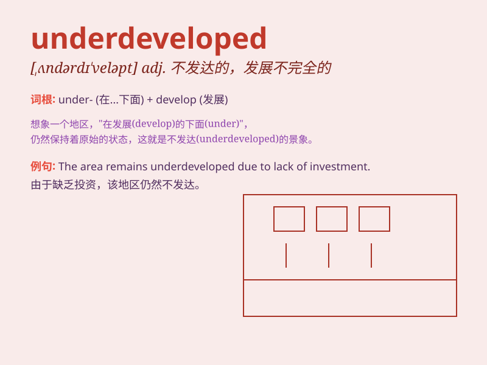

## underdeveloped

**英音:** _[ʌndədɪ\'veləpt]_ **美音:**
_[,ʌndɚdɪ\'vɛləpt]_

**译义:** *adj.不发达的*

### 短语

+ **underdeveloped country:** _不发达国家_

+ **underdeveloped region:** _欠发达地区_

+ **underdeveloped economy:** _欠发达的经济_

+ **underdeveloped area:** _未开发地区_

+ **underdeveloped muscle:** _不发达的肌肉_

### 例句

#### 例句1

> **The underdeveloped regions lack basic infrastructure and public
services.**

**中文翻译:** 欠发达地区缺乏基本的基础设施和公共服务。

**单词释义:** 发展不足的；不发达的

#### 例句2

> **Some underdeveloped countries depend mainly on agriculture for
their economy.**

**中文翻译:** 一些不发达国家的经济主要依赖农业。

**单词释义:** 经济不发达的

#### 例句3

> **The underdeveloped education system needs urgent improvement.**

**中文翻译:** 发展不完善的教育体系急需改进。

**单词释义:** 发展不够完善的

### 背诵小故事

> Once upon a time, there was a small country. Its industries were
weak, its education was poor. It was underdeveloped. People worked hard
to change this situation and make it prosperous.

**从前，有一个小国家。它的工业薄弱，教育落后。它是不发达的。人们努力工作以改变这种状况并使其繁荣。**

### 图义

