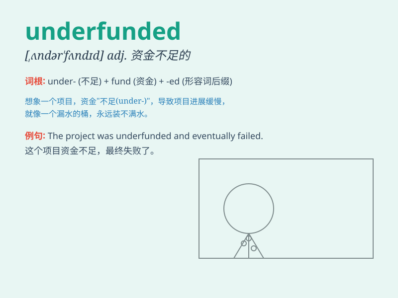

## underfunded

**英音:** _[ˌʌndəˈfʌndɪd]_ **美音:** _[ˌʌndərˈfʌndɪd]_

**译义:** *adj.资金不足的；投入资金不足的*

### 短语

+ **underfunded project:** _资金不足的项目_

+ **underfunded department:** _资金短缺的部门_

+ **underfunded initiative:** _资金匮乏的倡议_

+ **underfunded research:** _资金不足的研究_

+ **underfunded program:** _资金欠缺的计划_

### 例句

#### 例句1

> **The school is underfunded and lacks basic resources.**

**中文翻译:** 这所学校资金不足，缺乏基本资源。

**单词释义:** 资金不足的

#### 例句2

> **The research project was underfunded, making it difficult to
achieve the expected results.**

**中文翻译:** 这个研究项目资金不足，使得难以取得预期的结果。

**单词释义:** 资金短缺的

#### 例句3

> **The charity organization is constantly struggling due to being
underfunded.**

**中文翻译:** 由于资金不足，这个慈善组织一直在苦苦挣扎。

**单词释义:** 经费不足的

### 背诵小故事

> A small school was underfunded. It lacked enough money for new books
and equipment. The students had to share old textbooks. But they didn\'t
give up, hoping for more funds one day.

**一所小型学校资金不足。它没有足够的钱购买新书和设备。学生们不得不共用旧课本。但他们没有放弃，希望有一天能获得更多资金。**

### 图义

