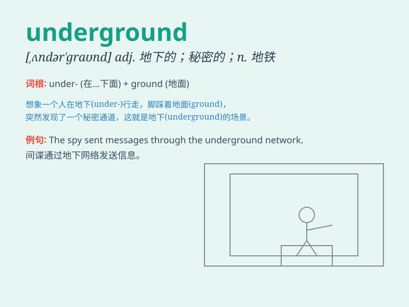

## underground

**英音:** _[ʌndə\'graʊnd]_ **美音:** _[ʌndɚˈɡraʊnd]_

**译义:** *adj.地下的,地面下的,秘密的n.[英]
地铁adv.在地下,秘密地*

### 短语

+ **underground railway:** _地铁_

+ **underground parking:** _地下停车场_

+ **go underground:** _隐藏起来；转入地下_

+ **underground passage:** _地下通道_

+ **underground water:** _地下水_

### 例句

#### 例句1

> **The metro runs underground.**

**中文翻译:** 地铁在地下运行。

**单词释义:** 在地下

#### 例句2

> **They built an underground bunker for emergencies.**

**中文翻译:** 他们建造了一个地下掩体以应对紧急情况。

**单词释义:** 地下的

#### 例句3

> **The underground movement against the regime gained momentum.**

**中文翻译:** 反对政权的地下运动势头强劲。

**单词释义:** 秘密的，非法的

### 背诵小故事

> One day, a little mouse was lost in an underground cave. It was dark
and scary. But with its brave heart, the mouse finally found the way
out. The underground is like a hidden world beneath the surface.

**有一天，一只小老鼠在一个地下洞穴里迷路了。那里又黑又可怕。但凭借勇敢的心，老鼠最终找到了出路。underground
就像地表之下的隐藏世界。**

### 图义

