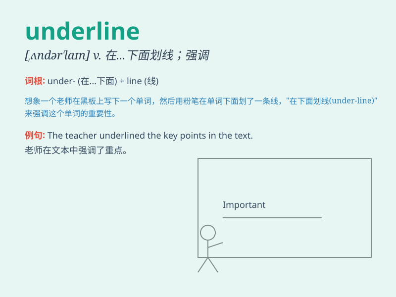

## underline

**英音:** _[ʌndə\'laɪn]_ **美音:** _[\'ʌndəlaɪn]_

**译义:** *vt.在\...下面划线,作\...的衬里,加下划线,强调n.下划线*

### 短语

+ **underline the importance:** _强调重要性_

+ **underline the words:** _在单词下面划线_

+ **underline the sentence:** _给句子划线_

+ **underline one\'s name:** _在某人名字下面划线_

+ **underline the key points:** _划出重点_

### 例句

#### 例句1

> **Please underline the key words in this passage.**

**中文翻译:** 请在这段文字的关键词下划线。

**单词释义:** 给\...\...下划线

#### 例句2

> **The mistakes in your composition have been underlined.**

**中文翻译:** 你作文中的错误已用下划线标出。

**单词释义:** 用下划线标出

#### 例句3

> **The importance of this point should be underlined.**

**中文翻译:** 应该强调这一点的重要性。

**单词释义:** 强调

### 背诵小故事

>
有一天，老师在黑板上写字，为了强调重点，她用一支彩色的笔在字下面画线（underline）。同学们一下子就明白了这些是关键内容。

**有一天，老师在黑板上写字，为了强调重点，她用一支彩色的笔在字下面画线（在......下面划线；强调）。同学们一下子就明白了这些是关键内容。**

### 图义

