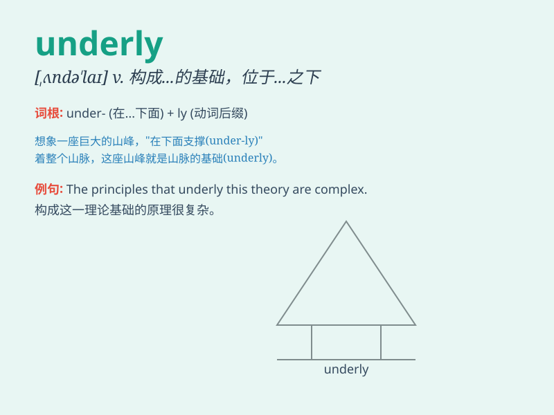

## underly

**英音:** _[ˌʌndəˈlaɪ]_ **美音:** _[ˌʌndərˈlaɪ]_

**译义:** *vt.位于\...之下；成为\...的基础；作为\...的原因*

### 短语

+ **underlying cause:** _根本原因；潜在原因_

+ **underlying asset:** _基础资产；相关资产_

+ **underlying assumption:** _基本假设；潜在假设_

+ **underlying structure:** _基础结构；底层结构_

+ **underlying principle:** _根本原则；基本原则_

### 例句

#### 例句1

> **The theory underlies much of modern physics.**

**中文翻译:** 这个理论是现代物理学的许多内容的基础。

**单词释义:** 构成...的基础；作为...的原因

#### 例句2

> **Emotional problems may underly his poor performance at
school.**

**中文翻译:** 情绪问题可能是他在学校表现不佳的原因。

**单词释义:** 是...的潜在原因；构成...的基础

#### 例句3

> **Certain principles underly all successful businesses.**

**中文翻译:** 某些原则是所有成功企业的基础。

**单词释义:** 构成...的基础；作为...的根据

### 背诵小故事

> 想象一个探险家在地下挖掘宝藏，他发现了一块神秘的基石，这块基石
UNDERLY
着整个宝藏洞穴的结构。它就像隐藏在深处的关键支撑，默默起着基础和支撑的重要作用。

**想象一位探险家在地下挖掘宝藏，他发现一块神秘基石支撑着整个宝藏洞穴结构，就像单词underly表示在...之下；构成...的基础；作为...的原因**

### 图义

