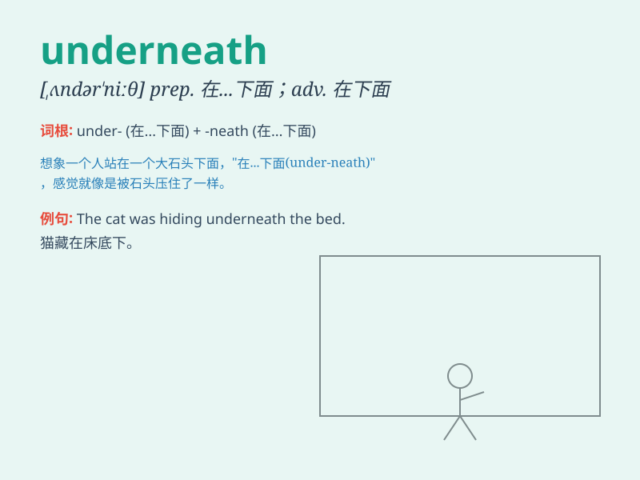

## underneath

**英音:** _[ʌndə\'niːθ]_ **美音:** _[,ʌndɚ\'niθ]_

**译义:** *adv.在下面 prep.在\...的下面*

### 短语

+ **underneath the surface:** _在表面之下_

+ **underneath the bed:** _在床底下_

+ **underneath the carpet:** _在地毯下面_

+ **underneath the tree:** _在树下_

+ **underneath the stars:** _在星空下_

### 例句

#### 例句1

> **The cat is hiding underneath the bed.**

**中文翻译:** 这只猫正藏在床底下。

**单词释义:** 在\...下面

#### 例句2

> **She found the key underneath the mat.**

**中文翻译:** 她在垫子下面找到了钥匙。

**单词释义:** 在\...底下

#### 例句3

> **The book was underneath a pile of papers.**

**中文翻译:** 这本书在一堆文件下面。

**单词释义:** 在\...下方

### 背诵小故事

> A little mouse was hiding underneath a big chair. It was very scared
because a cat was nearby. But luckily, the cat didn\'t find it.
\'Underneath\' means below or beneath something.

**一只小老鼠正躲在一把大椅子下面。它非常害怕，因为附近有一只猫。但幸运的是，猫没有发现它。\'underneath\'意思是在某物的下面或下方。**

### 图义

