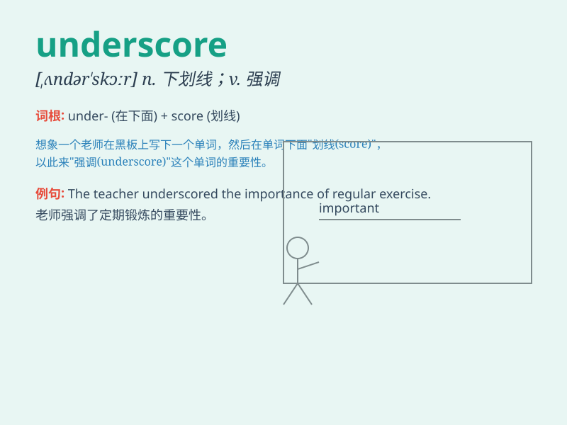

## underscore

**英音:** _[ʌndə\'skɔː]_ **美音:** _[,ʌndɚ\'skɔr]_

**译义:** *vt.划线于\...下,强调n.底线*

### 短语

+ **underscore the importance:** _强调重要性_

+ **underscore one\'s words:** _在某人的话下划线_

+ **underscore a mistake:** _强调一个错误_

+ **underscore the need:** _强调需求_

+ **underscore a point:** _强调一个观点_

### 例句

#### 例句1

> **The report underscores the importance of early education.**

**中文翻译:** 这份报告强调了早期教育的重要性。

**单词释义:** 强调

#### 例句2

> **Her silence underscored her disagreement.**

**中文翻译:** 她的沉默突出表明了她的不同意。

**单词释义:** 突出表明

#### 例句3

> **The recent events underscore the need for better security
measures.**

**中文翻译:** 最近的事件凸显了对更好的安全措施的需求。

**单词释义:** 凸显

### 背诵小故事

> A little mouse was running under the scoreboard. It wanted to hide
and find a safe place. \'Under\' means beneath and\'score\' is like
marks or points. So, when combined, \'underscore\' means to emphasize or
give importance.

**一只小老鼠在计分板下面跑。它想藏起来找个安全的地方。\'Under\'意思是在\...\...下面，\'score\'是分数、记号。所以，合起来，\'underscore\'意思是强调、着重。**

### 图义

