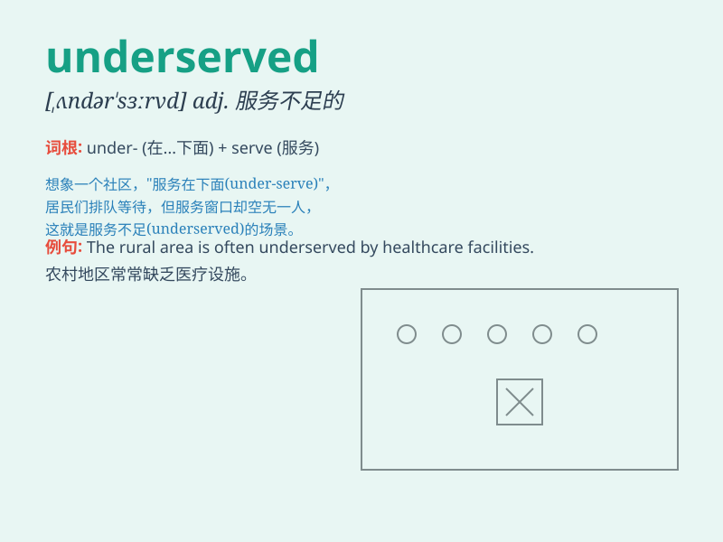

## underserved

**英音:** _[ʌndə\'sɜːvd]_ **美音:** _[ʌndə\'sɜːvd]_

**译义:** *adj.服务不周到的,服务水平低下的*

### 短语

+ **underserved area:** _服务不足的地区_

+ **underserved community:** _服务欠缺的社区_

+ **underserved market:** _未得到充分服务的市场_

+ **underserved population:** _未获充分服务的人群_

+ **underserved need:** _未得到满足的需求_

### 例句

#### 例句1

> **The rural areas are often underserved in terms of healthcare
facilities.**

**中文翻译:** 农村地区在医疗设施方面常常服务不足。

**单词释义:** 服务不足的

#### 例句2

> **Some underserved communities lack access to quality
education.**

**中文翻译:** 一些服务不足的社区缺乏获得优质教育的机会。

**单词释义:** 服务不足的

#### 例句3

> **The underserved neighborhoods need more investment in
infrastructure.**

**中文翻译:** 这些服务不足的社区在基础设施方面需要更多的投资。

**单词释义:** 服务不足的

### 背诵小故事

>
想象一个小镇，有部分地区的居民总是得不到足够的服务，比如快递送不到、路灯常坏没人修。这些地区就被称为
\'underserved\' 地区，意思就是服务不足的。

**想象一个存在服务不足情况的小镇的故事来辅助记忆\'underserved\'这个单词，意为服务不足的**

### 图义

