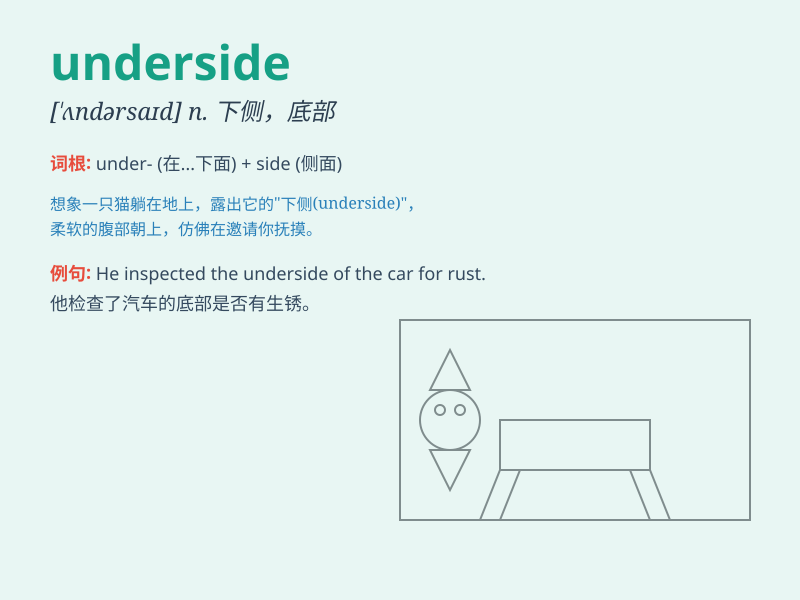

## underside

**英音:** _[\'ʌndəsaɪd]_ **美音:** _[\'ʌndɚsaɪd]_

**译义:** *n.下面,内面,下腹,下侧*

### 短语

+ **the underside of a leaf:** _叶子的底面_

+ **the underside of a chair:** _椅子的底部_

+ **the underside of a vehicle:** _车辆的底部_

+ **the underside of a bridge:** _桥的下部_

+ **the underside of a rock:** _岩石的底面_

### 例句

#### 例句1

> **The underside of the car was rusty.**

**中文翻译:** 汽车的底部生锈了。

**单词释义:** 底部；下面

#### 例句2

> **She examined the underside of the leaves for pests.**

**中文翻译:** 她检查叶子的下面是否有害虫。

**单词释义:** 下面；底面

#### 例句3

> **The underside of the bridge was in need of repair.**

**中文翻译:** 这座桥的底部需要维修。

**单词释义:** 底部；下部

### 背诵小故事

> One day, a little monkey was climbing a tree. It wanted to reach a
fruit on the underside of a branch. But it was a bit difficult. Finally,
with effort, it got the fruit.

**一天，一只小猴子在爬树。它想要够到树枝下面的一个水果。但这有点困难。最终，经过努力，它得到了水果。**

### 图义

