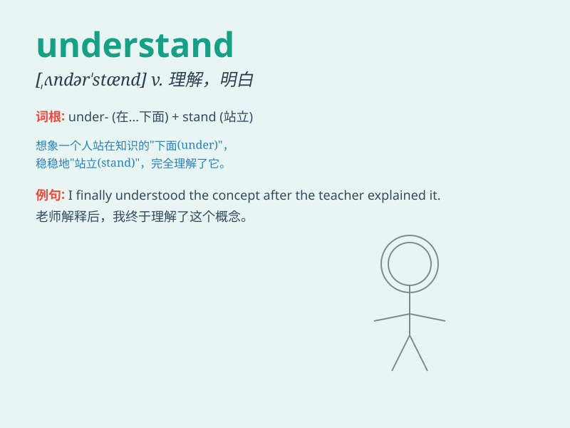

## understand

**英音:** _[ʌndə\'stænd]_ **美音:** _[\'ʌndɚ\'stænd]_

**译义:** *v.懂,了解,听说,推定,以为,省略*

### 短语

+ **understand clearly:** _清楚地理解_

+ **understand fully:** _完全理解_

+ **begin to understand:** _开始理解_

+ **fail to understand:** _未能理解_

+ **try to understand:** _试图理解_

### 例句

#### 例句1

> **I understand your concern.**

**中文翻译:** 我理解你的担忧。

**单词释义:** 理解；明白

#### 例句2

> **It\'s difficult to understand his motives.**

**中文翻译:** 很难理解他的动机。

**单词释义:** 理解；领会

#### 例句3

> **Do you understand the instructions?**

**中文翻译:** 你明白这些指示吗？

**单词释义:** 明白；懂得

### 背诵小故事

> One day, I was reading a difficult book. But as I kept reading and
thinking carefully, I gradually began to \'understand\' the ideas in it.
It felt like solving a mystery, and I was so happy.

**有一天，我在读一本很难的书。但随着我不断阅读和仔细思考，我逐渐开始"理解"其中的想法。这感觉就像解开了一个谜团，我非常高兴。**

### 图义

