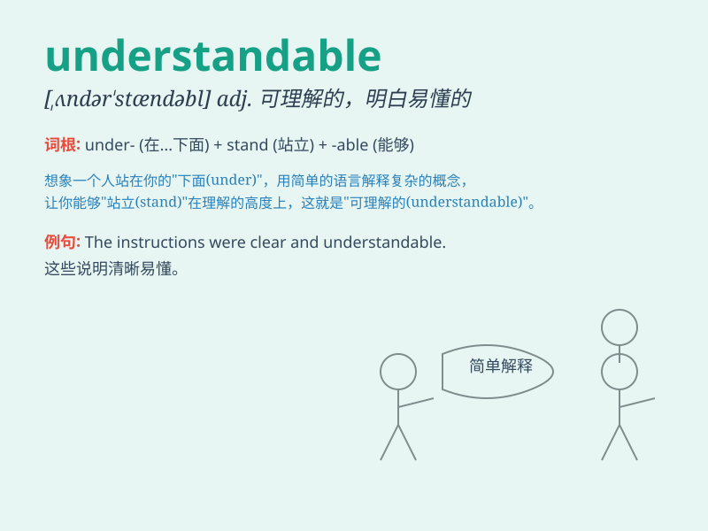

## understandable

**英音:** _[ʌndə\'stændəbl]_ **美音:**
_[\'ʌndɚ\'stændəbl]_

**译义:** *adj.可以理解的,可懂的*

### 短语

+ **quite understandable:** _完全可以理解_

+ **fairly understandable:** _相当可以理解_

+ **easily understandable:** _容易理解_

+ **understandable mistake:** _可以理解的错误_

+ **understandable explanation:** _可以理解的解释_

### 例句

#### 例句1

> **The teacher\'s explanation was understandable and all the
students grasped the key points.**

**中文翻译:** 老师的解释通俗易懂，所有学生都掌握了重点。

**单词释义:** 可以理解的；易懂的

#### 例句2

> **It\'s understandable that you are nervous before the exam.**

**中文翻译:** 在考试前你感到紧张是可以理解的。

**单词释义:** 合情理的；可以理解的

#### 例句3

> **His decision was quite understandable given the
circumstances.**

**中文翻译:** 鉴于当时的情况，他的决定是完全可以理解的。

**单词释义:** 可以理解的；说得通的

### 背诵小故事

> One day, Tom made a mistake. But his explanation was very clear and
everyone found it understandable. They knew exactly why he did that. So,
no one blamed him.

**一天，汤姆犯了个错误。但他的解释非常清晰，每个人都觉得可以理解。他们完全明白他为什么那样做。所以，没人责怪他。**

### 图义

