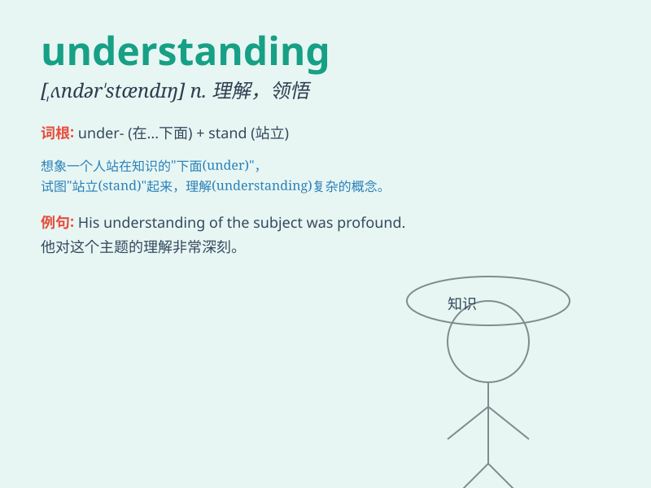

## understanding

**英音:** _[ʌndə\'stændɪŋ]_ **美音:** _[,ʌndɚ\'stændɪŋ]_

**译义:** *n.谅解,理解*

### 短语

+ **mutual understanding:** _相互理解_

+ **come to an understanding:** _达成谅解；取得共识_

+ **lack of understanding:** _缺乏理解_

+ **deep understanding:** _深刻理解_

+ **understanding of sth:** _对某事的理解_

### 例句

#### 例句1

> **I have a deep understanding of this complex issue.**

**中文翻译:** 我对这个复杂的问题有深刻的理解。

**单词释义:** 理解；领会

#### 例句2

> **Our understanding of the universe is constantly evolving.**

**中文翻译:** 我们对宇宙的理解在不断发展。

**单词释义:** 理解；认识

#### 例句3

> **She showed great understanding when I made a mistake.**

**中文翻译:** 当我犯错时，她表现出极大的体谅。

**单词释义:** 体谅；谅解

### 背诵小故事

> One day, Tom was lost in a strange city. A kind local helped him find
his way. Through this experience, Tom gained a better understanding of
kindness and helpfulness.

**有一天，汤姆在一个陌生的城市迷路了。一位善良的当地人帮他找到了路。通过这次经历，汤姆对善良和乐于助人有了更好的理解。**

### 图义

