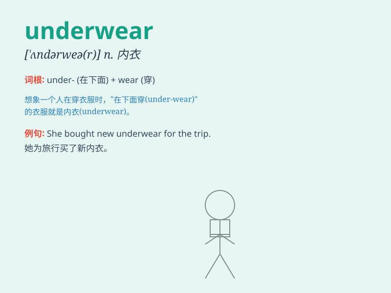

## underwear

**英音:** _[\'ʌndəweə]_ **美音:** _[\'ʌndɚwɛr]_

**译义:** *n.内衣裤*

### 短语

+ **men\'s underwear:** _男士内衣_

+ **women\'s underwear:** _女士内衣_

+ **thermal underwear:** _保暖内衣_

+ **cotton underwear:** _棉质内衣_

+ **sexy underwear:** _性感内衣_

### 例句

#### 例句1

> **She bought some new underwear for the trip.**

**中文翻译:** 她为这次旅行买了一些新的内衣。

**单词释义:** 内衣

#### 例句2

> **His underwear was all wrinkled.**

**中文翻译:** 他的内衣全都皱了。

**单词释义:** 内衣

#### 例句3

> **I need to change my underwear after the workout.**

**中文翻译:** 锻炼完后我需要换内衣。

**单词释义:** 内衣

### 背诵小故事

> One day, Tom was in a hurry to go out but couldn\'t find his favorite
pair of underwear. He searched everywhere under the bed and in the
closet. Finally, he found it under a pile of clothes. Underwear is so
important for our daily comfort!

**一天，汤姆匆忙要出门但找不到他最喜欢的那条内裤。他在床底下和衣柜里到处找。最后，他在一堆衣服下面找到了。内裤对于我们日常的舒适太重要了！**

### 图义

