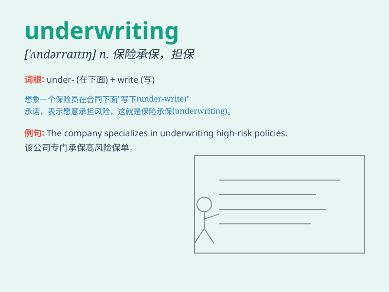

## underwriting

**英音:** _[ˌʌndəˈraɪtɪŋ]_ **美音:** _[ˌʌndərˈraɪtɪŋ]_

**译义:** *n.保险业*

### 短语

+ **underwriting risk:** _承保风险_

+ **underwriting profit:** _承保利润_

+ **underwriting capacity:** _承保能力_

+ **underwriting standards:** _承保标准_

+ **underwriting agreement:** _承保协议_

### 例句

#### 例句1

> **The bank is involved in underwriting large corporate loans.**

**中文翻译:** 这家银行参与承销大型公司贷款。

**单词释义:** 承销

#### 例句2

> **The insurance company\'s underwriting process is very strict.**

**中文翻译:** 这家保险公司的承保过程非常严格。

**单词释义:** 承保

#### 例句3

> **Underwriting the bond issue was a risky business.**

**中文翻译:** 承销这次债券发行是一项有风险的业务。

**单词释义:** 承销

### 背诵小故事

>
想象一下，一艘大船在狂风巨浪中航行，保险公司勇敢地承担了为这艘船担保的责任，这就是\'underwriting\'。就像在风险之下勇敢地写保证书，保证承担可能的损失。

**想象保险公司为大船承担担保责任来辅助记忆\'underwriting\'这个单词，意思是承保，核保**

### 图义

