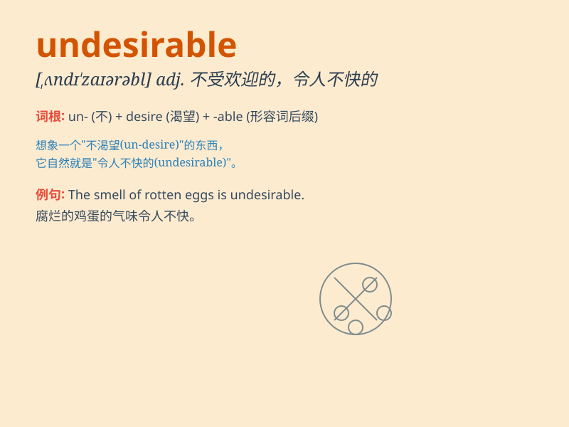

## undesirable

**英音:** _[ʌndɪ\'zaɪərəb(ə)l]_ **美音:**
_[,ʌndɪ\'zaɪərəbl]_

**译义:** *adj.不合需要的,不受欢迎的,令人不快的*

### 短语

+ **undesirable consequences:** _不良后果_

+ **undesirable behavior:** _不良行为_

+ **undesirable element:** _不良分子_

+ **undesirable situation:** _不良状况_

+ **undesirable effect:** _不良影响_

### 例句

#### 例句1

> **The presence of these chemicals is highly undesirable in our
drinking water.**

**中文翻译:** 这些化学物质出现在我们的饮用水中是非常不受欢迎的。

**单词释义:** 不受欢迎的；不良的

#### 例句2

> **Such behavior is undesirable in a civilized society.**

**中文翻译:** 这种行为在文明社会中是不良的。

**单词释义:** 不良的；不好的

#### 例句3

> **We should try to eliminate all undesirable elements from the
team.**

**中文翻译:** 我们应该努力从团队中消除所有不良因素。

**单词释义:** 不良的；不利的

### 背诵小故事

> In a quiet town, a mysterious person showed up. Everyone felt uneasy
because his behavior was strange and unacceptable. We called him
\'undesirable\'. It means not wanted or not desirable.

**在一个安静的小镇上，出现了一个神秘的人。每个人都感到不安，因为他的行为奇怪且令人难以接受。我们称他为'不受欢迎的人'。这个单词意思是不想要的；不受欢迎的**

### 图义

