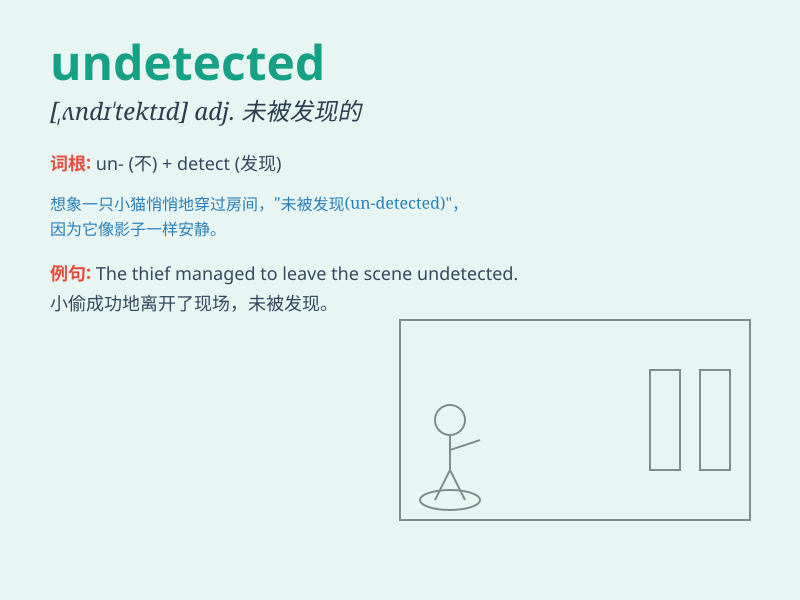

## undetected

**英音:** _[ʌndɪ\'tektɪd]_ **美音:** _[\'ʌndɪ\'tɛktɪd]_

**译义:** *adj.未被发现的,未被识破的*

### 短语

+ **remain undetected:** _保持未被发现_

+ **go undetected:** _未被察觉_

+ **pass undetected:** _未被发现地通过_

+ **escape undetected:** _未被发现地逃脱_

+ **operate undetected:** _未被发现地运行_

### 例句

#### 例句1

> **The thief managed to escape undetected.**

**中文翻译:** 这个小偷设法未被察觉地逃跑了。

**单词释义:** 未被察觉的

#### 例句2

> **The virus remained undetected for a long time.**

**中文翻译:** 这种病毒很长时间都未被检测到。

**单词释义:** 未被发现的

#### 例句3

> **The error went undetected until it caused a major problem.**

**中文翻译:** 这个错误一直未被察觉，直到它引发了一个大问题。

**单词释义:** 未被发现的

### 背诵小故事

> A spy was on a mission, moving around the enemy base undetected. He
skillfully avoided all the guards and cameras, remaining unseen and
uncaught. Finally, he completed his task and left safely.

**一名间谍在执行任务，在敌人基地周围活动却未被发现。他巧妙地避开了所有的守卫和摄像头，一直未被看见和抓住。最后，他完成了任务并安全离开。**

### 图义

