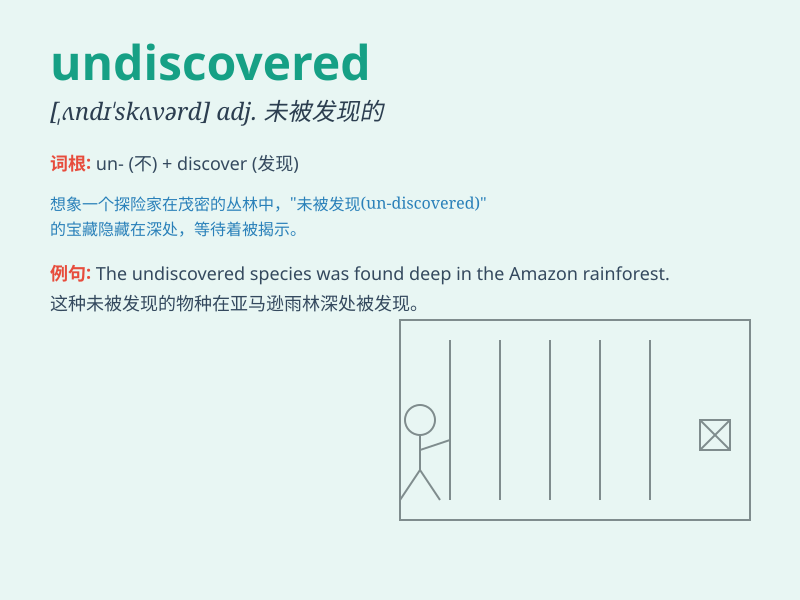

## undiscovered

**英音:** _[ˌʌndɪˈskʌvəd]_ **美音:** _[ˌʌndɪˈskʌvərd]_

**译义:** *adj.未被发现的,隐藏的*

### 短语

+ **undiscovered talent:** _未被发现的才能_

+ **undiscovered country:** _未被发现的国家_

+ **undiscovered treasure:** _未被发现的宝藏_

+ **undiscovered secret:** _未被发现的秘密_

+ **undiscovered cave:** _未被发现的洞穴_

### 例句

#### 例句1

> **The undiscovered cave held many secrets.**

**中文翻译:** 这个未被发现的洞穴隐藏着许多秘密。

**单词释义:** 未被发现的

#### 例句2

> **There might be undiscovered species in the deep ocean.**

**中文翻译:** 在深海可能有未被发现的物种。

**单词释义:** 未被发现的

#### 例句3

> **The scientist dedicated his life to finding undiscovered
treasures.**

**中文翻译:** 这位科学家一生致力于寻找未被发现的宝藏。

**单词释义:** 未被发现的

### 背诵小故事

> In a vast jungle, there was a hidden cave filled with precious gems.
For years, it remained undiscovered. One day, a brave explorer stumbled
upon it by chance. The cave\'s secret was finally revealed.

**在一片广阔的丛林中，有一个隐藏着珍贵宝石的洞穴。多年来，它一直未被发现。有一天，一位勇敢的探险家偶然发现了它。这个洞穴的秘密终于被揭开了。**

### 图义

