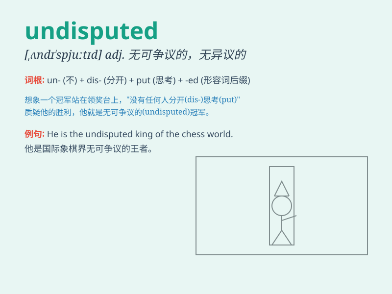

## undisputed

**英音:** _[ʌndɪ\'spjuːtɪd]_ **美音:**
_[,ʌndɪ\'spjutɪd]_

**译义:** *adj.无可置辩的,无异议的*

### 短语

+ **undisputed champion:** _无可争议的冠军_

+ **undisputed fact:** _无可争辩的事实_

+ **undisputed leader:** _无可置疑的领导者_

+ **undisputed authority:** _毋庸置疑的权威_

+ **undisputed masterpiece:** _无可非议的杰作_

### 例句

#### 例句1

> **He is the undisputed champion of the game.**

**中文翻译:** 他是这场比赛无可争议的冠军。

**单词释义:** 无可争议的

#### 例句2

> **The company holds the undisputed lead in the market.**

**中文翻译:** 该公司在市场上占据着无可争议的领先地位。

**单词释义:** 无可争议的

#### 例句3

> **Her talent as a singer is undisputed.**

**中文翻译:** 她作为歌手的才华是无可争议的。

**单词释义:** 无可争议的

### 背诵小故事

> A warrior entered a fighting tournament. He won every match with
amazing skills. His victory was undisputed. No one doubted his strength
and he became the champion without any argument.

**一位战士参加格斗比赛。他以惊人的技艺赢得了每一场比赛。他的胜利是无可争议的。没人怀疑他的实力，他毫无争议地成为了冠军。**

### 图义

