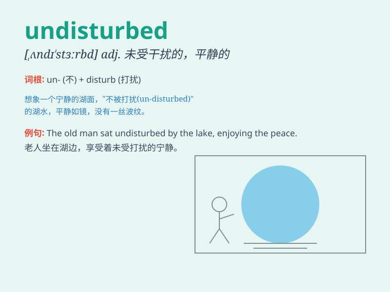

## undisturbed

**英音:** _[ʌndɪ\'stɜːbd]_ **美音:** _[,ʌndɪ\'stɝbd]_

**译义:** *adj.没受到干扰的,安静的,镇定的*

### 短语

+ **undisturbed sleep:** _未受打扰的睡眠_

+ **undisturbed area:** _未受干扰的区域_

+ **remain undisturbed:** _保持未受干扰_

+ **undisturbed nature:** _未被破坏的自然_

+ **live undisturbed:** _平静地生活_

### 例句

#### 例句1

> **The library provides a quiet and undisturbed environment for
study.**

**中文翻译:** 图书馆提供了一个安静且不受干扰的学习环境。

**单词释义:** 不受干扰的

#### 例句2

> **He enjoyed an undisturbed sleep last night.**

**中文翻译:** 他昨晚睡了个安稳觉。

**单词释义:** 安稳的；不受打扰的

#### 例句3

> **The undisturbed forest is home to many rare species.**

**中文翻译:** 这片未受干扰的森林是许多稀有物种的家园。

**单词释义:** 未受干扰的

### 背诵小故事

> A hermit lived in a cave, undisturbed by the outside world. He
enjoyed his peaceful life, free from any disturbances. One day, a lost
traveler found the cave but respected the hermit\'s undisturbed state
and left quietly.

**一位隐士住在一个洞穴里，不受外界干扰。他享受着平静的生活，没有任何打扰。有一天，一个迷路的旅行者发现了洞穴，但尊重隐士不受干扰的状态，悄悄地离开了。**

### 图义

