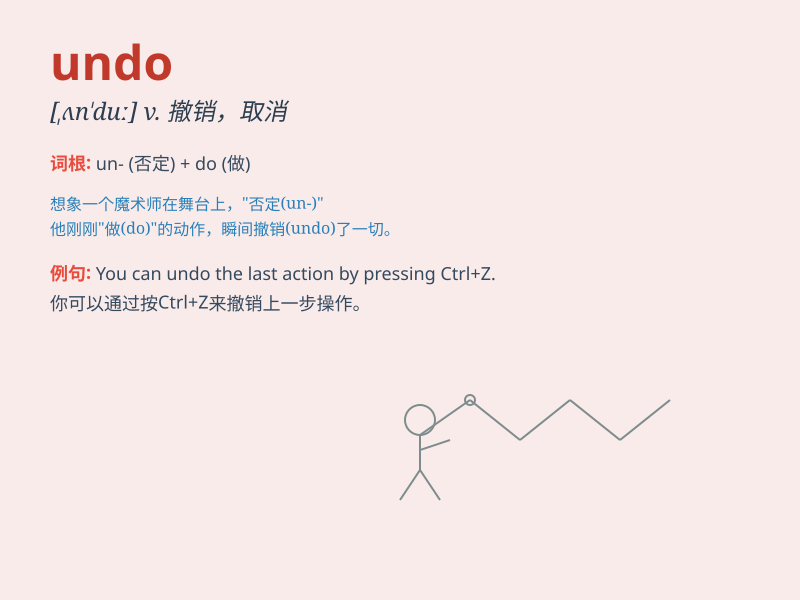

## undo

**英音:** _[ʌn\'duː]_ **美音:** _[ʌn\'du]_

**译义:** *vt.解开,松开v.取消 撤消*

### 短语

+ **undo a knot:** _解开一个结_

+ **undo a button:** _解开纽扣_

+ **undo a mistake:** _纠正错误_

+ **undo the damage:** _消除损害_

+ **undo the zip:** _拉开拉链_

### 例句

#### 例句1

> **I accidentally deleted the file and had to undo the action.**

**中文翻译:** 我不小心删除了文件，不得不撤销这个操作。

**单词释义:** 撤销；取消

#### 例句2

> **It\'s too late to undo the damage that has been done.**

**中文翻译:** 现在要消除已经造成的损害已经太晚了。

**单词释义:** 消除；弥补

#### 例句3

> **She tried to undo the knot but couldn\'t.**

**中文翻译:** 她试图解开这个结，但解不开。

**单词释义:** 解开；松开

### 背诵小故事

> One day, Tom made a big mistake when drawing. Luckily, he found he
could undo his wrong strokes and start again. Finally, he finished a
perfect picture.

**一天，汤姆画画时犯了个大错。幸运的是，他发现自己可以撤销错误的笔画然后重新开始。最终，他完成了一幅完美的画。**

### 图义

