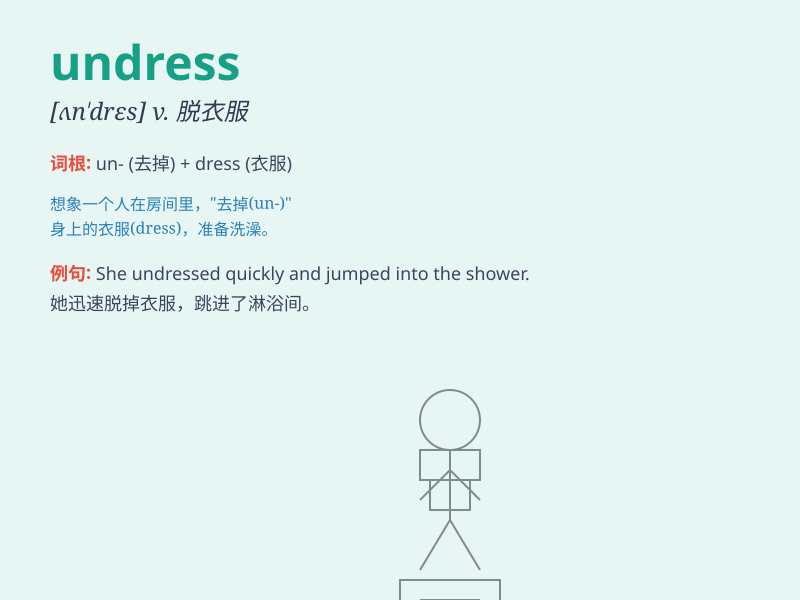

## undress

**英音:** _[ʌnˈdres]_ **美音:** _[ʌnˈdres]_

**译义:** *vt.使脱衣服,暴露,使卸去装饰vi.脱衣服n.便服,晨衣*

### 短语

+ **undress oneself:** _自己脱衣服_

+ **undress completely:** _完全脱掉衣服_

+ **undress hurriedly:** _匆忙脱衣服_

+ **undress slowly:** _慢慢地脱衣服_

+ **begin to undress:** _开始脱衣服_

### 例句

#### 例句1

> **She began to undress after a long day at work.**

**中文翻译:** 在漫长的一天工作之后，她开始脱衣服。

**单词释义:** 脱衣服

#### 例句2

> **The doctor asked the patient to undress for the examination.**

**中文翻译:** 医生让病人脱衣服进行检查。

**单词释义:** 脱衣服

#### 例句3

> **He watched her undress through the keyhole.**

**中文翻译:** 他透过钥匙孔看她脱衣服。

**单词释义:** 脱衣服

### 背诵小故事

> One night, a thief broke into a house. But the owner was awake and
saw the thief trying to undress quickly to hide. The owner called the
police and the thief was caught.

**一天晚上，一个小偷闯进了一所房子。但主人醒着，看到小偷正试图快速脱衣服来躲藏。主人报了警，小偷被抓住了。**

### 图义

