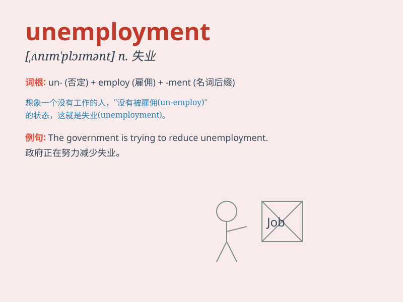

## unemployment

**英音:** _[ʌnɪm\'plɒɪm(ə)nt; -em-]_ **美音:**
_[,ʌnɪm\'plɔɪmənt]_

**译义:** *n.失业,失业人数*

### 短语

+ **unemployment rate:** _失业率_

+ **unemployment benefit:** _失业救济金_

+ **unemployment insurance:** _失业保险_

+ **chronic unemployment:** _长期失业_

+ **structural unemployment:** _结构性失业_

### 例句

#### 例句1

> **The government is taking measures to reduce unemployment.**

**中文翻译:** 政府正在采取措施来降低失业率。

**单词释义:** 失业；失业率

#### 例句2

> **High unemployment rates are a major concern for the economy.**

**中文翻译:** 高失业率是经济的一个主要关注点。

**单词释义:** 失业；失业率

#### 例句3

> **Unemployment has led to many social problems.**

**中文翻译:** 失业已经导致了许多社会问题。

**单词释义:** 失业

### 背诵小故事

> Once upon a time, in a small town, many people were facing
unemployment. They had no jobs and struggled to make ends meet. But with
effort and new opportunities, some finally found work and escaped the
trap of unemployment.

**从前，在一个小镇上，很多人面临着失业。他们没有工作，难以维持生计。但通过努力和新的机会，一些人最终找到了工作，摆脱了失业的困境。**

### 图义

