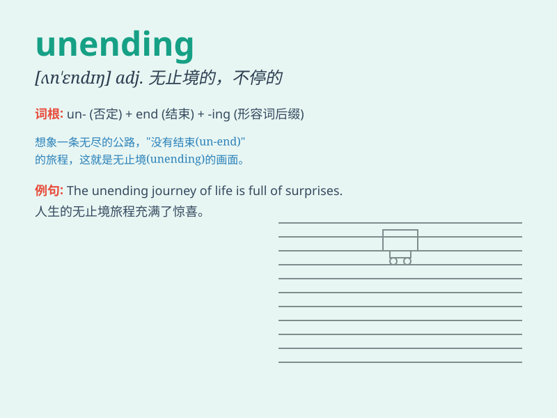

## unending

**英音:** _[ʌn\'endɪŋ]_ **美音:** _[ʌn\'ɛndɪŋ]_

**译义:** *adj.无终止的,不停的,不死的,永恒的,不断的*

### 短语

+ **unending patience:** _无尽的耐心_

+ **unending love:** _永恒的爱_

+ **unending struggle:** _无休止的斗争_

+ **unending journey:** _永无止境的旅程_

+ **unending task:** _没完没了的任务_

### 例句

#### 例句1

> **The unending traffic jam made me late for work.**

**中文翻译:** 无休止的交通堵塞让我上班迟到了。

**单词释义:** 无休止的；不停的

#### 例句2

> **She was tired of the unending chores at home.**

**中文翻译:** 她厌倦了家里没完没了的家务。

**单词释义:** 没完没了的

#### 例句3

> **The unending rain caused floods in the area.**

**中文翻译:** 不停的雨在这个地区造成了洪水。

**单词释义:** 不停的

### 背诵小故事

> A brave knight embarked on a journey. He faced countless challenges
but never gave up. His quest seemed unending. Just like this knight\'s
adventure, unending means having no end, going on and on forever.

**一位勇敢的骑士踏上了旅程。他面临无数挑战但从未放弃。他的探索似乎永无止境。就像这位骑士的冒险一样，unending
意思是没有尽头，永远持续下去。**

### 图义

