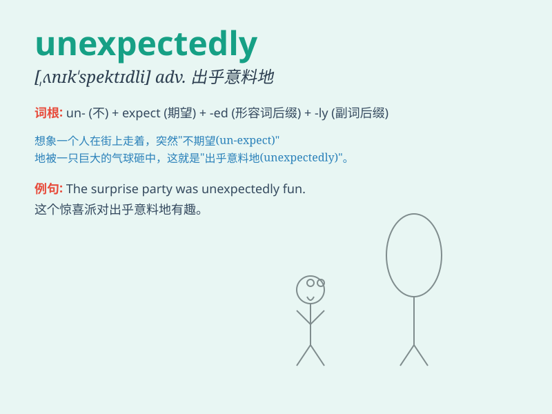

## unexpectedly

**英音:** _[ˌʌnɪksˈpɛktɪdli]_ **美音:**
_[ˌʌnɪkˈspɛktɪdli]_

**译义:** *adv.出乎意料地,想不到地*

### 短语

+ **unexpectedly high:** _出乎意料地高_

+ **unexpectedly late:** _出乎意料地晚_

+ **unexpectedly difficult:** _出乎意料地困难_

+ **unexpectedly good:** _出乎意料地好_

+ **unexpectedly calm:** _出乎意料地平静_

### 例句

#### 例句1

> **The train arrived unexpectedly early.**

**中文翻译:** 火车出乎意料地早到了。

**单词释义:** 出乎意料地

#### 例句2

> **He unexpectedly showed up at the party.**

**中文翻译:** 他出乎意料地出现在了聚会上。

**单词释义:** 出乎意料地

#### 例句3

> **The news came unexpectedly and shocked everyone.**

**中文翻译:** 这个消息出乎意料地传来，震惊了所有人。

**单词释义:** 出乎意料地

### 背诵小故事

> One day, I was walking in the park. Unexpectedly, a bird landed on my
shoulder. I was so surprised because I never thought this would happen.

**有一天，我正在公园里散步。出乎意料地，一只鸟落在了我的肩膀上。我非常惊讶，因为我从未想过会发生这种事。**

### 图义

