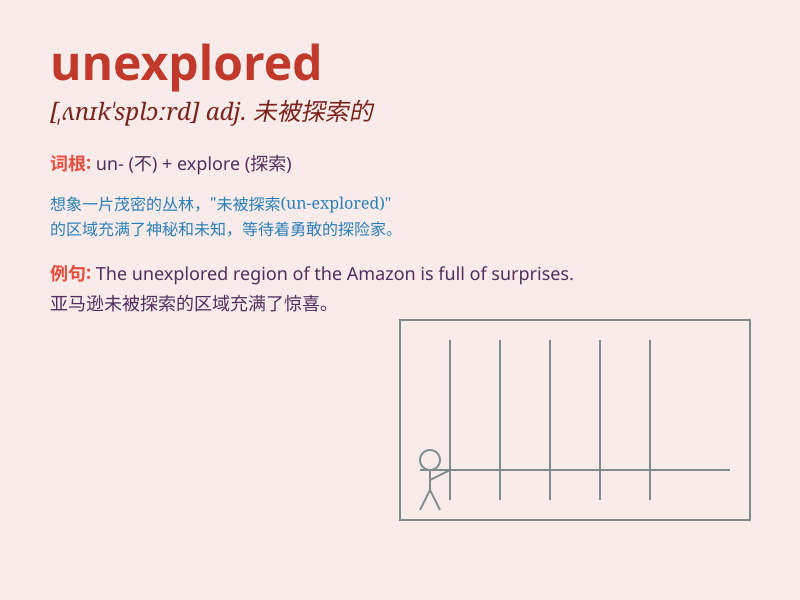

## unexplored

**英音:** _[ˌʌnɪkˈsplɔːd]_ **美音:** _[ˌʌnɪkˈsplɔːrd]_

**译义:** *adj.未经勘探的；未探索的；未探究的*

### 短语

+ **unexplored territory:** _未探索的领域_

+ **unexplored potential:** _未开发的潜力_

+ **unexplored option:** _未探索的选择_

+ **unexplored cave:** _未勘探的洞穴_

+ **unexplored path:** _未走过的路径_

### 例句

#### 例句1

> **The unexplored forest was full of mystery and danger.**

**中文翻译:** 这片未被探索的森林充满了神秘和危险。

**单词释义:** 未被探索的

#### 例句2

> **There are still many unexplored areas in the field of
science.**

**中文翻译:** 在科学领域仍有许多未被探索的领域。

**单词释义:** 未被探索的

#### 例句3

> **The unexplored cave attracted many adventurous spelunkers.**

**中文翻译:** 这个未被探索的洞穴吸引了许多爱冒险的洞穴探险者。

**单词释义:** 未被探索的

### 背诵小故事

> A brave adventurer set out to explore a mysterious land. But this
place was unexplored. No one knew what was hidden there. It was full of
unknowns and challenges. The adventurer was excited to be the first to
discover its secrets.

**一位勇敢的探险家出发去探索一片神秘的土地。但这个地方尚未被探索过。没人知道那里隐藏着什么。它充满了未知和挑战。这位探险家很兴奋能成为第一个发现其秘密的人。**

### 图义

