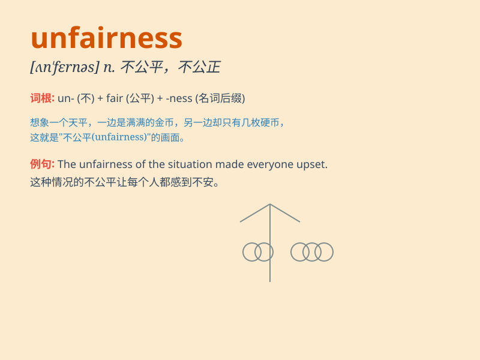

## unfairness

**英音:** _[ˌʌnˈfeərnəs]_ **美音:** _[ˌʌnˈfɛrnəs]_

**译义:** *n.不公平,不公正,不公平的行为或情况*

### 短语

+ **social unfairness:** _社会不公平_

+ **economic unfairness:** _经济不公平_

+ **unfairness in distribution:** _分配不公平_

+ **unfairness of treatment:** _待遇不公平_

+ **perceived unfairness:** _察觉到的不公平_

### 例句

#### 例句1

> **The unfairness of the distribution system led to social
unrest.**

**中文翻译:** 分配制度的不公平导致了社会动荡。

**单词释义:** 不公平

#### 例句2

> **She couldn\'t bear the unfairness in the workplace and decided to
quit.**

**中文翻译:** 她无法忍受工作场所的不公平，决定辞职。

**单词释义:** 不公平

#### 例句3

> **The unfairness of the competition rules raised many
complaints.**

**中文翻译:** 比赛规则的不公平引起了许多抱怨。

**单词释义:** 不公平

### 背诵小故事

> A poor student was always treated unfairly in the exam. The
teacher\'s bias caused great unfairness. But the student didn\'t give up
and fought for justice. Eventually, the unfairness was corrected.

**一个贫困的学生在考试中总是受到不公平的对待。老师的偏见造成了极大的不公平。但这个学生没有放弃，为正义而斗争。最终，不公平被纠正了。**

### 图义

