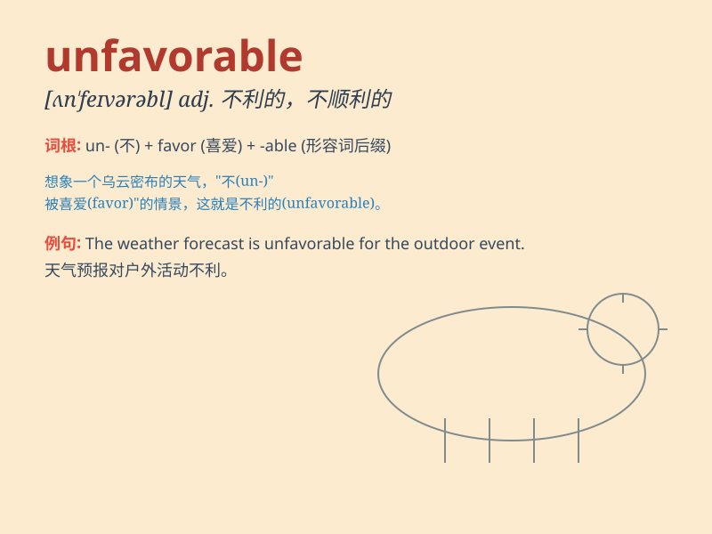

## unfavorable

**英音:** _[ʌnˈfeɪvərəbl]_ **美音:** _[ˌʌnˈfeɪvərəbəl]_

**译义:** *adj.不宜的,不顺利的,相反的,令人不快的*

### 短语

+ **unfavorable balance:** _贸易逆差_

+ **unfavorable comment:** _不利的评论_

+ **unfavorable condition:** _不利条件_

+ **unfavorable impression:** _不良印象_

+ **unfavorable outcome:** _不利的结果_

### 例句

#### 例句1

> **The weather conditions were unfavorable for our outdoor
event.**

**中文翻译:** 天气状况对我们的户外活动不利。

**单词释义:** 不利的

#### 例句2

> **His remarks about the new policy were highly unfavorable.**

**中文翻译:** 他对新政策的评论非常不利。

**单词释义:** 不利的；负面的

#### 例句3

> **The economic situation is currently unfavorable for small
businesses.**

**中文翻译:** 目前的经济形势对小企业不利。

**单词释义:** 不利的

### 背诵小故事

> A young athlete was very sad because the weather on the competition
day was unfavorable. It was rainy and windy, making it hard for him to
perform well. But he didn\'t give up. Unfavorable means not good or not
helpful.

**一位年轻的运动员非常伤心，因为比赛当天的天气不利。又下雨又刮风，这让他很难发挥出色。但他没有放弃。unfavorable
意思是不好的，不利的。**

### 图义

