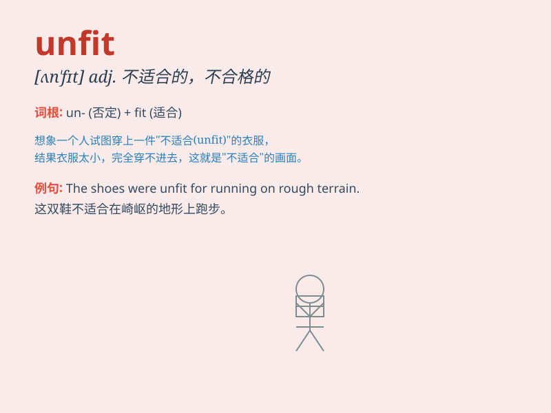

## unfit

**英音:** _[ʌnˈfɪt]_ **美音:** _[ʌnˈfɪt]_

**译义:** *adj.(～ for) 不适宜的,不适当的v.不适合*

### 短语

+ **unfit for:** _不适合；不适宜_

+ **be unfit to:** _不适合；不胜任_

+ **unfit condition:** _不健康状况；不合格状态_

+ **unfit person:** _不合格的人；不健康的人_

+ **unfit exercise:** _不适当的运动_

### 例句

#### 例句1

> **He is unfit for the job because of his lack of experience.**

**中文翻译:** 他因为缺乏经验不适合这份工作。

**单词释义:** 不适合

#### 例句2

> **The old bike is unfit to ride anymore.**

**中文翻译:** 这辆旧自行车已经不适合再骑了。

**单词释义:** 不适合

#### 例句3

> **The athlete was declared unfit to compete due to an injury.**

**中文翻译:** 由于受伤，这位运动员被宣布不适合参加比赛。

**单词释义:** 不适合

### 背诵小故事

> A man always ate junk food and never exercised. As a result, he
became unfit and couldn\'t run fast or do heavy work. His doctor said he
needed to change his lifestyle.

**一个男人总是吃垃圾食品且从不锻炼。结果，他变得不健康，跑不快也做不了重活。他的医生说他需要改变生活方式。**

### 图义

