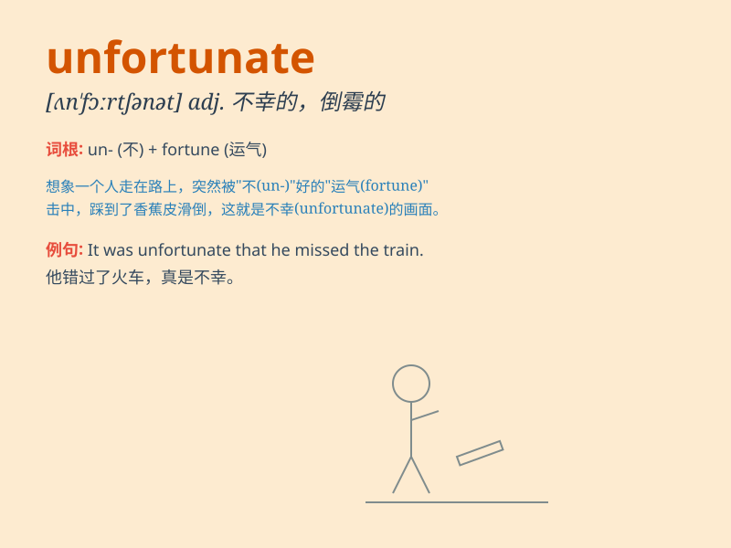

## unfortunate

**英音:** _[ʌn\'fɔːtʃ(ə)nət]_ **美音:**
_[ʌn\'fɔrtʃənət]_

**译义:** *adj.不幸的,不合宜的,不吉利的,使人遗憾的n.不幸的人*

### 短语

+ **unfortunate event:** _不幸的事件_

+ **unfortunate accident:** _不幸的事故_

+ **unfortunate circumstance:** _不幸的情况_

+ **unfortunate choice:** _不幸的选择_

+ **unfortunate outcome:** _不幸的结果_

### 例句

#### 例句1

> **It was unfortunate that she missed the train.**

**中文翻译:** 她错过了火车，这很不幸。

**单词释义:** 不幸的；令人遗憾的

#### 例句2

> **The unfortunate man lost his job and his house in the same
month.**

**中文翻译:** 这个不幸的人在同一个月里丢了工作又失去了房子。

**单词释义:** 不幸的；倒霉的

#### 例句3

> **It is unfortunate that such an accident happened.**

**中文翻译:** 发生这样的事故真是不幸。

**单词释义:** 不幸的；令人遗憾的

### 背诵小故事

> A man was going to have an important job interview. But
unfortunately, he got lost on the way and missed the chance. This made
him very sad and frustrated.

**一个男人正要去参加一个重要的工作面试。但不幸的是，他在路上迷路了，错过了机会。这让他非常伤心和沮丧。**

### 图义

