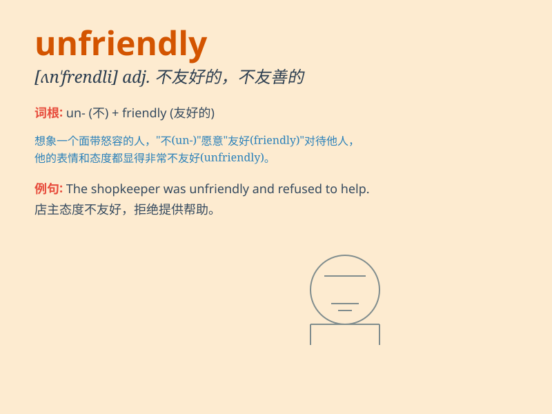

## unfriendly

**英音:** _[ʌn\'fren(d)lɪ]_ **美音:** _[ʌn\'frɛndli]_

**译义:** *adv.不友善地,不利地*

### 短语

+ **unfriendly attitude:** _不友好的态度_

+ **unfriendly environment:** _不友好的环境_

+ **unfriendly behavior:** _不友好的行为_

+ **unfriendly competition:** _不友好的竞争_

+ **unfriendly remarks:** _不友好的言论_

### 例句

#### 例句1

> **The people in this town are unfriendly and always keep to
themselves.**

**中文翻译:** 这个镇上的人不友好，总是独来独往。

**单词释义:** 不友好的

#### 例句2

> **I found the service at that restaurant unfriendly and
unprofessional.**

**中文翻译:** 我发现那家餐厅的服务不友好且不专业。

**单词释义:** 不友好的

#### 例句3

> **His unfriendly attitude made me reluctant to talk to him.**

**中文翻译:** 他不友好的态度让我不愿和他说话。

**单词释义:** 不友好的

### 背诵小故事

> One day, I went to a new city and met a person. When I tried to talk
to him, he gave me a cold look and didn\'t answer. His attitude was
unfriendly. It made me feel very uncomfortable.

**有一天，我去了一个新城市并遇到一个人。当我试图和他交谈时，他冷冷地看了我一眼且不回答。他的态度是不友好的。这让我感到非常不舒服。**

### 图义

