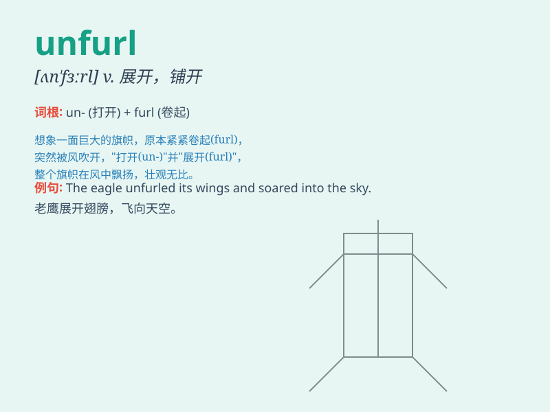

## unfurl

**英音:** _[ʌn\'fɜːl]_ **美音:** _[\'ʌn\'fɝl]_

**译义:** *vt.展开,展示,公开,使旗招展vi.打开,展开,显露*

### 短语

+ **unfurl a banner:** _展开一面旗帜_

+ **unfurl the sail:** _展开船帆_

+ **unfurl a map:** _展开一张地图_

+ **unfurl one\'s wings:** _展开翅膀_

+ **unfurl the flag:** _展开旗帜_

### 例句

#### 例句1

> **The flag unfurled in the wind.**

**中文翻译:** 旗帜在风中展开。

**单词释义:** 展开；打开

#### 例句2

> **She unfurled the map on the table to study the route.**

**中文翻译:** 她在桌子上展开地图来研究路线。

**单词释义:** 展开；铺开

#### 例句3

> **The flower unfurled its petals in the morning sun.**

**中文翻译:** 花朵在早晨的阳光下展开花瓣。

**单词释义:** 展开；伸展

### 背诵小故事

> A brave sailor was on a ship. When the wind blew strongly, he
unfurled the sail to catch the wind and let the ship move faster. It
means to open or spread out something, like the sail.

**一位勇敢的水手在船上。当强风吹来时，他展开船帆以借助风力，让船行驶得更快。这意味着打开或展开某物，比如船帆。**

### 图义

